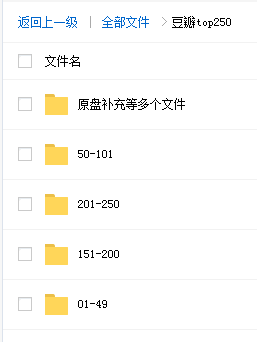

# 资源分类

<b>

点击展开查看
</b>

## 资源目录

实际内容比目录多
http://note.youdao.com/noteshare?id=4de9b7b9635fd93a143b02b00519ca44（若打不开则在最下面）

目录可以搜到的资源(搜索方法上面链接有详解)，有偿分享！支持试听试看，非诚勿扰！

## 收费标准（可自行对比TaoBao同类资源价格）

#### 套餐一：单个平台 10 元/永久

单个平台是指比如像'混沌大学'，10 元包含目录里看到的所有'混沌大学'平台课程，付费后邀你加入[单平台学习群](https://github.com/2020sunshine/VIP-Learning/blob/master/img/tc02.png)。

#### 套餐二：全网 vip 会员 55 元/永久

内容包含：目录上看到的所有平台课程，两千多个栏目，100 万价值课程，加后期每天更新，每周上新 6 到 7 个新栏目。平台随便一个栏目就 200 元，现只需 60 元加入[全网 vip 会员共享学习群](https://github.com/2020sunshine/VIP-Learning/blob/master/img/tc03.png)，永久免费更新！后期课程资源每更新增加 3000G 针对后加入会员涨价 10 元 ，入会 70 元、80 元以此类推，前面会员一次加入永久免费更新，早加入早受益，时间就是金钱，效率就是生命，不要等到价格上涨了说之前咨询价，一律按阶段价。

<!-- <b>

二、电影 & 美剧（3T）
</b>

## 收费标准：10 元/永久 （全网vip会员免费）

电影如图：

美剧如图：

 -->

# 售后服务

<b>

一、VIP 会员终身免费学习
</b>

海量课程，买到就是赚到。内容丰富，适用于各行各业相关人群。一生中总会遇到你需要学习需要新知识的时候，愿为每一位需要学习的您服务。

<b>

二、加入会员后不满意，直接退款
</b>

加入会员后碰到诸如觉得买贵了、心情不好不想要了、看不懂下载说明、当地限制了网盘登录等等问题，1小时内都可以直接找我退款，敬请各位朋友放心。

# 联系我们

我的微信：**a1527462933**
添加请备注：**获取付费资源**

否则不予以通过！！！

<b>

资源目录清单(部分)
</b>

## 超级资料库永久会员社群目录（2020-01-20更新）
                           欢迎加入本社群

永久会员包含：喜马拉雅、得到、樊登读书会、混沌大学、唯库、网易云课堂、知乎live、千聊、荔枝微课、36氪 、蜻蜓FM  、三节课、 一块听听、 极客时间、 职问 、万门大学、互联网网赚课程、 等其他数十家平台。包含1000多个栏目，

每周增加5到6个新栏目，购买后增加新节目免费看，总花费超过38万！随便一个栏目就200元，一个栏目的价格看几千个栏目，性价比棒棒哒，后续所有新增栏目免费！

课程搜索功能介绍

电脑：ctrl+f

加入社群后 免费发送

01千聊

		01.大J小D亲授：0-6岁全脑潜能开发，养成高情商高智商宝宝（完结）
		02.刘媛媛语言表达课【完结】
		03. 核聚北大思维编程（完结）
		04. 女神进化论寺主人亲授：12节补老“肌”密，教你蜕变冻龄女神（完结）
		05.秦小明思维升级训练营
		06.秦小明 金融思维训练营 第四期
		07.小龙女投资课
		08小明会议解读【完结】
		09 台湾硬笔书法冠军叶晔：每天15分钟，3周写出一手漂亮字（完结）
		10.千聊一病一讲【完结】
		11.刘媛媛亲授：普通人快速崛起的31堂修炼课
		12.千聊增高课【完结】
		13.老秘书手把手教你如何在体制内破局与逆袭（更新中）
		14.惊云的思维课 第二季
		15.月薪3000，0基础也能赚够100万！（完结）
		16.如何引导男人为自己付出（完结）
		17.杜子健：从草根到总裁，零起点通关之道（完结）
		18.手把手教你零基础写作，业余时间月入过万（完结）
		19.迪丽热巴形象私教：价值百万的气质改造，让你蜕变为职场女神（完结 ）
		20. 老李校长的直播间（2018）（完结）
		21.上榜福布斯的主播：艾诚首度开讲！14堂财智人生的经营课（完结）
		22. 月入10万的副业赚钱法丨零成本，易操作，学完就能用丨赠38节精华笔记（完结）
		23.秦小明2018年末直播
		24.秦小明丨金融思维训练营丨第8期（完结）
		25.惊云｜人生进阶思维课（第三期）【完结】
		26.【完结】 赖世雄英语自学秘籍
		27.【完结】抖音热门歌曲速成让你C位出道
		28.【完结】花与兽备孕瑜伽
		29.【完结】张赟慧丨三元纳气风水详解
		30. 老李校长的直播间（2019全年课程）（更新中）
		31. 王不烦实用管理学，助你借力成事、破局而出
		32.李松蔚丨关系视角课（完结）
		33.理财课程逃离死工资
		34.20节儿童营养课（更新中）
		35.精准瘦身完结
		36.外挂训练营|用印象笔记有序管理一切信息，蜕变为百分之一做事漂亮且高效的精英|终生（完结）
		37.8堂课让你成为公文材料写作高手（完结）
		39.21天暴力突破英语（完结）
		40.《老秘书的直播间VIP>
		44.寺昆的321表达法
		43.《小颜瘦身徒手塑形术》【完结】
		46.《左志坚15节小白理财实战课》
		50 《不刷屏的朋友圈成交术》
		51.《27个懒人快速赚钱项目》
		52.《教你成为手机摄影高手》
		53.哈弗父母情商课【完结】
		54.《12堂超级搜索术，快速找到你想找的任何信息，资源，人脉》
		078.《中医美胸减肥术》

02 荔枝

		01.实体店业绩爆破系统（完结）
		02. 性情大师训练馆【男10课】（完结）
		03. 性情大师训练馆【女II】（更新中）
		04.人际交往2期：想跟任何人都聊得来？听这30本沟通书就够啦！（完结）
		05.人人可复制执行的10堂赚钱课
		06.36个小而美项目，让你月入10万
		07. 福布斯精英文豪：投资理财8节课，让你真正学会钱生钱（完结）
		08.老A处长·精讲职场权谋厚黑手段
		09 老路：用得上的商学课-100节（完结）
		11. 蓝小雨丨0基础学好销售话术，把话说到客户心窝里（完结）
		12方文山的音乐诗词课
		13 环球太太仪态导师：10节课提升气质，让你的魅力比别人更高级（完结）
		14.蓝小雨丨上市公司老板，教你年薪30万的赚钱方法(完结）
		15.犹太人的88个成功思维：打破思维局限，揭开聪明人的秘密！（完结）
		16.堂春节赚钱攻略，做这些事一周赚万元。
		17.【完结】北大心理学女神倬伦的 策略识人术
		18.近视界的奇迹：不手术、不吃药，11堂课教你摘掉眼镜！
		19.清华北大EMBA教授：普通人如何通过营销赚取第一个100万？（完结）
		20.人际交往1期：听完这十本书，从此告别低情商（完结）
		21.世界记忆大师深入浅出学记忆，九节课练就你的超强大脑
		22. 会说话不一定情商高，来听听年薪60万是如何练成的！（更新中）
		23.跟大佬学说话：央视主持人陈伟鸿的24堂（更新中）
		24.让你比别人聪明10倍的哈佛学习力课
		25. 斜杠老白 每天30分钟，21天掌握如何靠写作月入五万（完结）
		26. 10堂朋友圈营销实战课，没钱没人脉也能月入过万！（完结）
		27.【完结】12节体态魅力修炼
		28.【完结】让你大脑开窍的哈佛心智训练
		29.每天10分钟玩转朋友圈，6周带你开启年入百万之旅（完结）
		30.高情商沟通21天训练营
		31. 田珂 明星都在用的饮食方法
		32.39个副业赚钱项目
		33.【完结】靠读书也能月入上万，让你读过的书变成钱
		34天美胸训练营郭若曦
		35.北大心理学女神策略沟通术（完结）
		36.饭局社交攻略
		37.8堂客让你成为公文材料写作高手（完结）
		38.史上最全婚恋指南：如何发现升级搞定你的人生伴侣，听这些书就够了
		39.男士衣品拯救指南，快速提升你的穿搭高级感，13节视频课【完结】
		45 手把手教你0基础剪辑出超赞视频（完结）
		46 《头条付费专栏实战训练营》【完结】
		47 《抓住风口，小白也能逆袭为年入100W+微课导师》
		48.《作文冲刺提分课：36个方法，作文冲刺24+》
		49.《即兴表达，张口就说，让你把握每个关键时刻》

03 唯库

		00.福尔摩斯的绝技,国内王牌读心师教你识透人心【完结】
		00.小白速成PR软件实操:20节短视频赚钱课,教你月入过万【完结】
		001.阿何60天引爆你的学习力
		002.阿何思维导图
		003.阿何写作课
		004.零基础学芭蕾:收获完美体态与高贵气质（更新中）
		005.唯库个人品牌
		006.教你零基础写出一手漂亮好字(完结)
		007.12招让男神爱上你【完结】
		008.人人都需要的自信沟通秘籍完)
		009.恶魔奶爸sam影响100万人的英语学习方法(完)
		010.21天会计职称,考试突击:名师划重点,精准备考,轻松拿证! (完结)
		011.《高效有趣学Excel,轻松入门到高阶》【完结】
		012.大神教你玩转手机摄影,随手拍出好照片
		013.公众--号写作全解析,60天全面掌握新媒体写作秘诀【完结】
		014.零基础化妆美颜术(完结)
		015.堂实用礼仪课，助你职场生活游刃有余(更新中)
		017.公众--号写作全解析,60天全面掌握新媒体写作秘诀
		018.12堂赚钱必学文案课:让你的文案变成印钞机(完结)
		019.12堂实用脱单穿搭技巧,让男神对你一见钟情(完结)
		020,内容变现黄金秘诀:让创意"像病毒一样传播"(完结)
		021.《百日英语训练营》 【完结】
		022.奶爸英语听力训练营
		023.零基础学芭蕾:收获完美体态与高贵气质【完结】
		024.易shou体质
		025.12课教你0基础兼职开网店,月赚十万零花钱
		026,跟恶魔奶爸学英语: 20小时快速掌握英语核心秘诀(完结)
		027.新媒体变现实战训练营,30天开启副业赚钱(完结)
		028.甜蜜假期:手把手教你15道法式甜点
		029.史上最全买车攻略,带你防坑又省钱【完结】
		030.超级人脉术-快速找到你想找的任何人
		031.甜蜜假期:手把手教你15道法式甜点【完结】
		032.追求的艺术-李越恋爱课堂【完结】
		033.提高情商,改变人生的读心术(完结)
		034.心理学实战训练营:陪你30天重塑自我
		035.16堂顶级外教实用口语课,让你的英语脱口而出(完结)
		036.李立恒《阿里铁军销售真经》
		037,从马甲线到蜜桃臀,足不出户打造完美身材
		038,阿何谈时间管理(完结)
		039.唯库平面设计课
		040.零基础学会用手机拍短视频(完结)
		041.颠覆你想象的高效笔记术
		042·零基础做出能赚钱的公众--号(完结)
		043.征服麦克风:K歌之王养成术【完结】
		044.亚洲小姐教你超实用魅力提升术(完结)
		045,体态管理,气质女人瑜伽课
		046.零基础学photoshop, 18节课从小白到大神[完结)
		047.阿何-普通人可执行的赚钱思路课
		048.英语单词的奥秘-让你背单词快10倍的记忆法【完结】
		049.李蕾练就好声音【完结】
		050.月薪五干也能实现的买房全攻略,教你买对人生的第一套房
		051,爆款吸金文案训练营【完结】
		053.12堂快速阅读课, 10倍提升阅读效率【完结】
		054.shoutui
		055.公众--号高颜值排版术,从小白变身排版达人(更新中)
		056.15分钟美xiong 【完结】
		057.12堂超级搜索术:快速找到你想找的任何信息!资源!人脉! (完结)
		058.吃出牛奶肌(完结)
		059.零基础做出赚钱的多平台自媒体
		061.多国语言让外语飙起来
		062.13节安睡课,让你有效提高睡眠质量,精力充沛每一天【完结】
		063.手把手教你开一家赚钱的小店(完结)
		065.修炼美背天鹅颈,轻松显高5厘米,修炼完美身形曲线(完结)
		066.人生的第一堂逻辑实战课, 12招让你看得透!干得好!学得快! 【完结]
		067.12堂课教你打造口才影响力,好好说话,一开口就成交(完结)
		068.教你零基础做出高逼格PPT [完结]
		069.15堂女性理财课【完结】
		070.15堂明星冻龄养颜术【完结】
		071.30天阿何写作训练营,手把手教你快速成为月入过万的新媒体作者(完结)
		072.摄影实拍训练营,30天零基础变身摄影达人(完结)
		073.0基础趣学SEO,引爆流量,让客户主动找上门的躺赚神技(完结)
		074.12堂素人改造课,穿出明星范儿,赚足回头率【完结】
		075.不动砖瓦,不费力,只花500元，懒人也能营造温馨有格调的小窝【完结)
		076.12堂读书变现课,把读过的书变成钱
		078.韩式肌肤的秘密：12堂明星皮肤管理术(完结)
		080.13堂日式小颜术【完结】
		081.12节课教你规划家庭保险
		082.维密超模私教,教你12招打造紧致性感马甲线,轻松拥有s型曲线【完结]
		083.北大学霸教你快速学会你想学的任何知识【完结】
		084.樊登带你把书读薄,一次学透终身受用的经典畅销书【完结】
		085.超燃计划: 30天蜕变行动营,干掉平庸的自己【完结】
		086.一本新概念解决听说读写【完结】
		087.14堂超实用易上手明星美妆术
		088.一次性学透Excel函数,让你5分钟搞定一天的工作(完结)
		090.13堂PPT实操指南,教你快速做出职场加分的高颜值PPT(完结）
		091.30天让你拥有好声音【完结】
		092.零基础做出有颜又有料的手帐【完结】
		093.下班后写作,最有效的个人增值方法
		094.唐诗一百首倒背如流【完结】
		095.30天手绘训练营,0基础也能成为手绘大神(完结)
		096.人人必学的w--x群赚钱法【完结】
		097.公考冲刺: 17节课高分拿下申论【完结】
		098.零基础也能快速变身抖音网红舞达人【完结】
		099. 14堂课教你理性择偶,用经济学收获幸福【完结
		100.社群运营实战训练营,一起玩转社群经济,边打造个人品牌边赚钱(完结)
		101,零基础做出能赚钱的牛逼公众--号【完结】
		102.台湾明星御用微整形医师,医美全科普,不花冤枉钱,不开刀,教你安全地悄悄变美[完结]
		103.精准式表达(完结)
		104.14堂零基础小说写作课,从新手到网络畅销作家,百万稿费作者教你写小说(完结)
		105.文案实战变现特训营,30天手把手教你成为顶尖文案高手,一字值千金(完结)
		107.北大博士教你故事变现, 16课让你写出好故事【完结]
		108.零基础说出纯正美式口语【完结】
		109.12节在家也能练出性感蜜桃臀,让臀部变得圆、紧、翘
		110.气场修炼术:教你提升魅力值,成为一个受欢迎的女人(完结)
		111.30天考霸训练营,北大博士后教你通关任何考试,助你高分拿下证书、岗位、考试(完结)
		112.轻松战胜拖延症,抢回人生主动权【完结】
		113精准瘦身法【完结】
		114.12堂课成为超级带货网红博主【完结】
		115.做自己的女王: 14堂独立女性全面成长课【完结】
		117.30天美tui集训营(完结)
		121.人生赢家必修的12堂说话课【完结】
		122.随学随用的零基础手绘课【完结】
		123.你的老板不会讲给你的13节职场速胜课【完结】
		125.教你如何向领导汇报工作, 12堂课成就职场精英【完结】
		126.职场ppt全通关
		127.卸下疲惫,跟丁一晨画出你的生活【完结】
		128.16节超级美白课,让你白到自发光【完结】
		129.设计师基础班:从0进阶,设计师第1步
		130.15堂私域流量赚钱指南:让你的个人w--x变成提款机
		131.暴瘦有氧操:跟着世界小姐私教跳出迷人好身材
		132.谋生本领人人都能唱出好歌声【完结】
		133.甜蜜假期:手把手教你15道法式甜点【完结】

04 喜马拉雅

	01 商业财经
	02 演讲语言
	03 职场管理
	04 外语语言
	05 读书科教
	06 健康养生
	07 形象提升
	08 情感心理
	09 诗歌小说
	10 亲子育儿

01 商业财经

	01 识人快狠准：跟投资大咖学读懂人心的艺术（完）
	02 笔记侠
	03 跟100亿机构操盘手学炒股
	04 王英军律师：创业时代 决胜股权
	05 股市实战微技巧（完结）
	06 花卷财团-投资理财大全（完结）
	07 百合学姐：一听就能用的理财课
	08 钱老师第二季（完）
	09 牛散秘籍
	10 简七理财（完结）
	11 卢俊购房私藏技巧（完结）
	12 陈春花管理学著作精华解读【完结】
	13 每天听见吴晓波（完）
	14 诺亚财富学堂(完结)
	15 钱老师：从无产阶级到财富自由（完结）
	16 薛云奎讲价值投【完结】
	17 薛云奎进阶课【完结】
	18 肖星的财务课【完结】
	19 凯文?凯利：《KK对话未来》【完结】
	20 黄有璨运营课【完结】
	21 全球富豪传记精读：商业思维进阶课【完结】
	22 管清友投资【完结】
	23 叶檀的投资读书笔记【完结】
	24 马红漫的投资日历
	25 孙陶然亲授：企业管理实【完结】
	26 黑马营精华课：12位商界大佬的创业秘籍【完结】
	27 向松祚货币金融
	28 经济学家夏春的投资必修课【完结】
	29 中国经济72讲
	30 王英军律师：股权投资实战课（完结）
	31 王利杰：天使投资这么玩（完结）
	32 叶茂中：唤醒每个人的创意【完结】
	33 王福重《重·点》：经济学家教你如何洞察世界【完结】
	34 谢作诗的经济学课(完结)
	35 Jenny：101招练就最强理财大脑【完结】
	36 餐饮老板内参
	37 耶鲁大学陈志武教授的金融课【完结】
	38 北大纵横解密100家名企转型
	39 李清昊，19 带你精读40本金融经典【完结】
	40 倪建伟：顶级销售成长课（完
	41 每天听见吴晓波 第二季【完结】
	42 马红漫：读懂巴菲特投资逻辑【完结】
	43 路长全营销课堂
	44 孙宇晨：财务自由
	45 林建红的定位营销课【完结】
	46 李光斗品牌商学院【完结】
	47 空空道人的股市实战课【完结】
	48 方军：读懂互联网未来的50本书
	49 冯仑：房事夜话（完
	50 复旦名师团的经济学课
	51 靠谱周教你选基金（完结 )
	52 靠谱周投资经【完结】
	53 薪资进阶手册【完结】

02 演讲语言 

		01 治愈聊天终结者【完结】
		02 社交网络上的有效沟通【完结】
		03 像TED一样演讲，打造你的魅力【完结】
		04 小白到演讲高手的十堂课【完结】
		05 寇乃馨：演说改变命运【完结】
		06 央广然哥【完结】
		07 小学问【完结】
		08 易说语商人人都是演讲家【完结】
		09 超级聊天术
		10 好好说话第一季【完结】
		11 超级聊天术：如何成为沟通高手
		12 辩论思辨【完结】
		13 成为说服高手的心理课
		14 快速谈判：用博弈技巧搞定交往难题
		15 崔永元：像他一样说话【完结】
		16 老炮儿崔哥侃美国
		17 李诞池子的幽默工具箱【完结】
		18 生活无处不谈判【完结】
		19 王伟忠的人际关系课【完结】
		20 好好说话第二季（完
		21 郭论：18 郭德纲首档音频脱口秀 (完结)
		22 蔡康永的201堂情商课【完结】

03 职场管理

		01孙陶然详解《创业36条军规》【完结】
		02 情绪管理36计【完结】
		03 小强升职记：带你六步制作可实现的年度计划【完结】
		04 职场能力方程组【完结】
		05 不吃亏：参透中国式沟通36讲【完结】
		06 不懂汇报工作，还想升职加薪【完结】
		07 微表情神探姜振宇 ：听《鹿鼎记》学职场情场读心术【完结】
		08 张萌人生效率手册【完结】
		09 销售如何搞定人【完结】
		10 雾满拦江 中国职场潜规则36讲【完结】
		11 思维的精进：人生逆袭手册【完结】
		12 萧秋水：学会知识管理【完结】
		13 时间管理10堂课【完结】
		14高效男神尹志豪：60天练就高效竞争力【完结】
		15 李筱懿：职场要赢得漂亮【完结】
		16 没背景如何吸引贵人：3个月学会高端人脉经营法则
		17 王勇博弈论（完
		18 叶武滨时间管理进阶
		19 Lisa的人力资源管理课【完结】
		20 马东的职场B计划

04 外语语言 

		01 听《老友记》,学地道美语 第一辑不【完结】
		02 听《老友记》,学地道美语 第二辑【完结】
		03 听《老友记》,学地道美语 第三辑【完结】
		04 夏说英文 中国哲学简史句读 第一季【完结】
		05 夏说英文 中国哲学简史句读 第二季【完结】
		06 夏说英文2
		07 赵铁夫讲单词·解密单词的潜规则【完结】
		08 赖世雄｜英语学习方法论【完结】
		09 日语零基础至中高级（0-N2）【完结】
		10虎哥英语轻头条【完结】
		11 标准美语发音教程 小麦轻课【完结】
		12 3分钟贵族式英语【完结】
		13 国民英语背诵营
		14《赖世雄生活口语从头学》全书讲解音频
		15 新东方名师的死磕英语基础班
		16 好羞耻英语【完结】
		17 立足日本【完结】
		18 钟平逻辑英语联报班【完结】
		19 不一样的新概念【完结】
		20 不一样的新概念【2+3合辑】
		22 不走弯路英语【完结】
		23 跟着奥斯卡学英语
		24 英语深度纠音【完结】
		25 不一样的新概念英语【第4辑】
		25 孙亮：读魔法名著学英语
		27.《不一样的剑桥国际少儿英语》

05 读书科教

		01 高考提分秘籍：丁建略教授助你快速提【完结】
		02 上官文露解读张爱玲【完结】
		03 百家讲坛姜鹏品读《资治通鉴》【完结】
		04 单读第二季：与许知远一起逃离精神雾霾
		05 和莎士比亚的365天【完结】
		06 极简物理课【完结】
		07 未来简史中信书院出品（已完结）
		08 90天环游地球（完）
		09 曾国藩24锦囊(完)
		10 大锤教你如何十倍速读一本书(完）
		11 百家讲坛姜鹏精读《资治通鉴》·汉帝国（完结)
		12 茶经（完结）
		13 李开复：十堂人工智能课【完结】
		14 文明简史【完结】
		15 乐话《道德经》《完》
		16 记忆大师卢菲菲：25个窍门让你“过目不忘”【完结】
		17 烧脑天团：超级记忆力养成计划【完结】
		18 180最强大脑【完结】
		19 哲学100问【完结】
		20 易中天说禅【完结】
		21 薛将军精讲《孙 子 兵 法》【完结】
		22 中国通史大师课
		23 马瑞芳讲《聊斋志异》（完结）
		24 梁冬私房笔记-庄子的心灵自由之路【完结】
		25 人人都能懂的宇宙科技简史：淼叔开脑洞
		26 郦波解读曾国藩（完）
		27 平说历史【完结】
		28 意公子艺术课【完结】
		29 许子东细读张爱玲【完结】
		30 曾国藩《冰鉴》：教你看脸识人心（完）
		31 西 方 经 典 禁 书
		32 于晓非《金刚经》导读（完结）
		33 傅杰的复旦论语课（完结）
		34 京剧坤生王珮瑜：京剧其实很好玩【完结】
		35 精读职场晋升30本好书
		36 百家讲坛马骏品读中华战争史
		37 牛津学霸精读全球最新畅销书
		38 别以为你不需要懂世界史-大英帝国篇【完结】
		39 天文原来是这样
		40 今日简史【完结】
		41 天天听好书
		42 王阳明心学（完
		43 世界影史百年经典
		44 周濂讲西方哲学智慧【完结】
		45 孙思远：解读全球好书
		46 张雪峰：高考志愿填报必读【完结】
		47 精读24本股票投资经典【完结】
		48 王潇：十大传奇女性人生解读
		49 烧脑天团 训练营
		50 帝国时代：全球战争史【完结】
		51 黄明哲正解《道德经》
		52 哲学100问·第2季【完结】
		53 张其成讲《易经》（完
		54 了不起的博物馆【完结】
		55 度阴山讲阳明心学
		56 鲍鹏山私塾课?论语
		57 钱文忠信佛【完结】
		58 王蒙讲孔孟老庄【完结】
		59 许子东重读鲁迅【完结】
		60 中国文化必修

06 健康养生

		01 解决男人的“根本”焦虑(完)
		02 这么吃从源头开始预防癌症【完结】
		03 朱光：点燃你健身动力的十堂课(完结)
		04 陈允斌教你吃出健康（完结）
		05 张长青：50天陪你瘦下来（完结）
		06 张其成：《佛家养生大道》（完结）
		07 黄健翔讲足球【完结】
		08 产科门诊室
		09 林志玲御用医师陈峙嘉：越吃越瘦【完结】
		10 睡睡平安
		11 管理皮肤，17 这么做才科学【完结】
		12 傅国翔：食疗调理健康课
		13 90天高效减肥
		14 北大蒋文跃的中医养生课【完结】
		15 太极云手课

07 形象提升

		01 如何练就好声音--徐洁（完结）
		02 许锋说人事【完结】
		03 胡艺瀚的奢侈品普及课（完结）
		04 金鸽平：学钢琴必听20问【完结】
		05 古典音乐很难吗【完结】
		06 72穿搭有术—高价值形象修炼课【基础篇】(完)
		07 满分女神徐林【完结】
		08 醉鹅娘葡萄酒词典【完结】
		09 形象管理教练徐熠-24堂时尚必修课（完结）
		10 跟着龚琳娜学唱歌（完）
		11 陈果2017换个活法【完结】
		12 零基础入门学唱歌（完结）
		13 袁春楠：让你脱胎换骨的人生整理术【完结】
		14 徐敬东实现小目标的黑科技【完结】
		15 跟着龚琳娜来练声（完结）
		16 形象导师郭弈翎(完结)
		17 卢战卡：成为交际高手的72套功夫
		18 名曲密码：田艺苗和你的音乐下午茶

08 情感心理

		01 Ayawawa：如何得到你想要的婚姻与爱情（完）
		02 雷明教你读懂一个人：12种人格12种命（完结）
		03 一个人听的恋爱技巧（完结）
		04 麻辣情医吴迪：100天告别单身（完结）
		05 好男人也要学会撩妹
		06 张德芬 小时空修心课【完结】
		07 帅小冰教你看电影学心理学
		08 乐嘉性格色彩 婚恋宝典【完结】
		09 松明 挑战不可能 心理控制（完）
		10 换个角度，洞悉相处之道【完结】
		11 陈昌凯：心理学与社会生活【完结】
		12 乐嘉性格色彩读心术（完）
		13 一周一本心理书（完结）
		14 不理性再见：刘轩的心理学院
		15 张德芬的女性成长必修课（完结）

09 诗歌小说

		01 蒙曼品最美唐诗
		02 细说金瓶梅
		03 芝麻评书：读懂诗人才懂诗（完）
		04 张公子说金庸
		05 掌柜说西游记（完结）
		06 蒋勋细说红楼梦1-80回全 （完结）
		07 人民的名义(完)
		08 王立群品经典宋词（完结）
		09 纪连海说《西游记》（完）
		10 琅琊榜（完）
		11 麻衣神算子
		12 华少讲鬼故事：少说鬼话【完结】
		13 杨雨品历代名家词
		14 于丹品经典：过你想要的生活【完结】
		15 明朝那些事【完结】
		16 郦波：一生不可错过的唯美诗词【完结】
		17 郦波：最美情诗（完结）
		18 盈视：品读100首最美中国词
		19 芝麻评书-三国群英传
		20 100小词走天下【完结】
		21 马瑞芳品读《红楼梦》【完结】
		22 叶嘉莹先生：诗览众山小
		23 婷婷诗教第二季
		10 亲子育儿 01 超级宝宝“学商”私教课（完结）
		02 花生酥超懂小学生作文(完）
		03 王芳大语文课堂：如何提升语文软实力（完）
		04 美国私立小学的财商启蒙课【学生版】（完结）
		05 跟青春期的孩子这样沟通就对了（完）
		06 凯叔·声律启蒙【完结】
		07 正面管教（男娃版）
		08 林薇：10堂课让孩子拥有惊人专注力(完)
		09 罗指挥：儿童如何学音乐
		10 钱儿爸西游记一、二辑
		11 让孩子轻松说出地道英语
		12 听余世维《家教必修课》
		13 儿童心理博士陈忻：做父母总会遇到的30个“怎么办”（完 ）
		14 张怡筠亲子情商课·第2季
		15 歪歪兔情商教育小课堂： 好性格才是真优秀
		16 大鱼讲论语【完结】
		17 凯书西游记全集
		18 跟着西游记学作文
		19 复旦平哥语文（完结）
		20 天天游戏力【完结】
		21 每周带小学生共读一本书
		22 名师郦波的语文启蒙课（完结）
		23 北大Dr.帅澜让孩子更专注的心理学【完结】
		24 叶开的深夜书桌：写作！天天向上！
		25 万物启蒙
		26 陈默：如何做不焦虑的家长【完结】
		27 曹灿朗诵课【完结】
		28 正面管教（女娃版）
		29 大鱼论语·亲子国学(下)
		30 平说文学·城南旧事
		31 少年中国史
		32 押沙龙：少年世界史

10.亲子育儿

		01.超级宝宝“学商”私教课（完结）
		02.花生酥超懂小学生作文
		03.王芳大语文课堂：如何提升语文软实力（完结）
		04.美国私立小学的财商启蒙课【学生版】（完结）
		05.跟青春期的孩子这样沟通就对了（完）
		06.凯叔▪声律启蒙【完结】
		07.正面管教（男娃版）
		08.林薇：10堂让孩子拥有惊人专注力【完结】
		09.罗指挥：儿童如何学音乐
		10.钱儿爸西游记一、二辑
		11.让孩子轻松说出地道英语
		12.听余世雄《家教必修课》
		13.儿童心理博士陈忻：做父母总会遇到30个“怎么办”（完结）
		14.张怡筠亲子情商课▪第二季
		15.歪歪兔情商教育小课堂：好性格才是真优秀
		16.大鱼讲论语【完结】
		17.凯叔西游记全集
		18.跟着西游记学作文
		19.复旦平哥语文（完结）
		20.天天游戏力【完结】
		21.每周带小学生共读一本书
		22.名师郦波的语文启蒙课（完结）
		23.北大Dr.帅澜让孩子更专注的心理学【完结】
		24.叶开的深夜书桌：写作！天天向上！
		25.万物启蒙
		26.陈默：如何做不焦虑的家长【完结】
		27.曹灿朗诵课【完结】
		28.正面管教
		29.大鱼论语▪亲子国学
		30.平说文学▪城南旧事
		31.少年中国史
		32.押沙龙：少年中国史

19年上新

		001 李欣频的文案创意课
		002 哲学100问·第3季
		003 王东岳的中西哲学启蒙课
		004 平说两宋
		005 李银河说爱情
		006 世界名著大师课
		007 读懂诗人才懂诗·第二季
		008 陈正宏《史记》精讲
		009 清华北大状元学习法
		010 喜马讲书
		011 上官文露名著精读【第二季】
		012 knowyourself
		013 小米商战课：揭秘雷军核心打法【完结】
		014 张萌精力管理50讲
		015 张法中讲中国美术史
		016 马未都《国宝100》
		017 战隼：无需意志力的习惯养成法-100天行动【完结】
		018 叶清的好声音进修课【完结】
		019 好好说话第三季
		020 金庸合集
		021 世界的凛冬：二战的权力游戏
		022 刘慈欣的思想实验室
		023 清华朱武祥的商业模式课
		024 中国历史大变局
		025 秦朔书院：中美商业文明通史
		026 夏说英文口语学院
		027 了不起博物馆第二季
		028 汪蔚青省税实战课
		029 胡慎之心理课：重建亲密关系
		030 首席经济学家管清友的股票课
		031 阿里销售冠军：销售精英进阶课
		032 钟伟的买房必修课
		033 中国文学大师课
		034 谢涛有声历史剧：三国到明清
		035 快速获取你想要的任何人脉
		036 天猫创始总经理黄若的新零售课
		037 范景中讲西方艺术史
		038 张其成讲《黄帝内经》
		039 乐嘉性格色彩全能训练营
		040 潘毅·中医文化必修课
		041 李山教授解《诗经》
		042 世界历史大师课
		043 文案摇滚帮：让写作更简单
		044 网红训练营：超级IP打造计划
		045 战胜拖延症：你的认知需要大换血【完结】
		046 马大勇心解《三国演义》
		047 哈佛学霸赵路云教你财富管理传承
		048 汤婧平：商业百年
		049 汪诘&吴京平：科普经典解读课
		050 百家讲坛魏新：防小人宝典
		051 正德整夜陪睡：深睡合辑
		052 北北：21天演讲训练营
		053 每天听见吴晓波·第三季
		054 职场名师训练营：提升10项竞争力
		055 杨幂御用中医师：由内而外健康美丽
		056 讲给小白听的区块链名师课
		057 知否？知否？应是绿肥红瘦【完结】
		058 康震品读古诗词【完结】
		059 《红楼梦》全本有声剧
		060 郭论第二季
		061 谦道·于谦首档音频脱口秀
		062 齐善鸿讲《道德经》
		063 狄菲菲：28天美的声音成长计划
		064 梁晓玲：21天行动力强化训练营
		065 高琳 学会讲故事，才叫会沟通
		065 有道考神：百日英语听力训练【更新中】
		066 北大赵冬梅讲中国史
		066 黄有光的快乐经济学
		067 叶武滨时间管理九段
		068 大力丸儿多人有声剧：百部小说里的中国史
		071 樊登：可复制的领导力【完结】
		069 朱大可讲中国神话趣史
		070 张萌：8周财富高效能训练营
		072 战隼：无需意志力的习惯养成法-100天行动【完结】
		073 冯仑商业私房话
		074 邓亚萍世界冠军（心力）训练法
		075 微表情专家邵磊教你破译人心（完结）
		077 钱文忠讲佛教十三经（更新中）
		078 奥美文案女王林桂枝的创意课【完结】
		079 林志玲姐姐给小朋友的修养课
		088 兰彦岭讲鬼谷子（更新中）
		089 《混子曰：少年中国史上》 【完结】
		090 大英博物馆极简世界史
		091 阿里铁军内训销售课.第二季
		092 吕延杰：5G新机遇60讲
		093 海底小纵队广播剧（更新中）
		094.《傅配荣讲<道德经>》
		108.21天全面提升自信自尊
		110.《心理减肥术：做得到的高效瘦身法》
		111.【曲黎敏：精讲《黄帝内经》养生智慧】
		112 《长安十二时辰》【完结】
		113《首席话聊师：跟谁都能聊的来》
		114.《马继华：5G创业布局与思考》
		115 《超级实用投资心理学》
		118 《论生涯规划|2019年高考志愿填报》
		120 《5分钟高密度读书》
		121 《轻断食：脱胎换骨的懒人瘦身课》
		122 《平说语文：中小学语文学习方法2》
		123.《用心理学戒瘾，25天过上自律人生》
		124 《富爸爸穷爸爸：百万财商课》
		126 《蜜汁炖鲍鱼（杨紫、李现主演亲爱的热爱的原著》
		127 《从诞生到婚礼，营造幸福原生家庭》
		128 《老光：人人都需要的精准表达课》 
		129.《协和名医张羽带来女性健康课》
		130.《掘金5G通信革命》
		131.《樊登：可复制的沟通力》
		132.《京城律师团：企业法律风险必知》
		133.《孙瑞玲：少儿英语口语7分钟》
		134.《中国儿童分级阅读课（3-6岁）》
		135.《百家讲坛丁牧讲述：宋代后宫往事》
		136.《老光：小白也能听得懂的商业实战课》
		138.《千万粉丝操盘手教你如何做抖音》
		139.《系统创富：通向财富自由的快车道》
		140.【更新中】儿童教育专家贾静：情商口才课堂

05 得到

1、专栏

		01、何凡第二季【完结】
		02、精英日课第二季【完结】
		03、世界名刊速读【完结】
		04、前哨第二季【完结】
		05、武志红心理学【完结】
		06、刘润第二季【完结】
		07、关系攻略【完结】
		08、今天【完结】
		09、老浦识字【完结】
		10、薛兆丰经济学【完结】
		11、Dr.魏的教育宝典【完结】
		12、熊逸书院【完结】
		13、给孩子的博物学【完结】
		14、科学思维必修课【完结】
		15、张潇雨的商业经典案例【完结】
		16、西方艺术史【完结】
		17、宁向东管理学【完结】
		18、刘苏里·名家大课【完结】
		19、吴军第二季【完结】
		20、香帅的北大金融学课【完结】
		21、傅佩荣的西方哲学【完结】
		22、吴伯凡·认知方法论
		23、新知报告
		24、精英日课第三季
		25、张潇雨：商业经典案例课【完结】

2.听书

	2016年9月份

		9.26.贫穷的本质
		9.27.关键时刻
		9.28.决定未来的十种人
		9.29.沃顿商学院最受欢迎的谈判课
		9.30.如何轻松影响他人

	2016年10月份

		10.01.这样和世界相处
		10.02.知道做到
		10.03.全新思维
		10.04.黑天鹅
		10.05.你的团队需要会讲故事的人
		10.06.出版人
		10.07.最重要的事，只有一件
		10.08.精益创业
		10.09.反直觉询问
		10.10.学会提问
		10.11.最小阻力之路
		10.12.理性选民的神话
		10.13.意志力
		10.14.逆转
		10.15.瞬变	
		10.16.理性乐观派
		10.17.未来简史（上）
		10.18.未来简史（下）
		10.19.提问的艺术
		10.20.引爆点
		10.21.愚昧者的愚昧
		10.22.清醒思考的艺术
		10.23.创新者
		10.24.异类
		10.25.洗脑术
		10.26,沃顿商学院最受欢迎的成功课
		10.27.生猛的进化心理学
		10.28.演讲的力量
		10.29.解决冲突的关键技巧
		10.30.金钱不能买什么
		10.31.情绪急救

	2016年11月份

		11.01.刻意练习
		11.02.颠覆式创新
		11.03.智能时代
		11.04.失控
		11.05.蔡康永的说话之道
		11.06.科技想要什么
		11.07.抗压力
		11.08.高绩效教练
		11.09.增长的本质
		11.10.输赢心理学
		11.11.谈钱不伤感情
		11.12.海都物语
		11.13.单身社会
		11.14.反脆弱
		11.15.大脑超载时代的思考学
		11.16.请用数据说话
		11.17.浪潮之巅
		11.18.超越智商
		11.19.无为
		11.20.快节奏慢生活
		11.21.翻转式学习
		11.22.每天最重要的2小时
		11.23.混乱
		11.24.技术奇点
		11.25.安静的力量
		11.26.极简人类史
		11.27.优秀的绵羊
		11.28.简单思考
		11.29.创业融资，从一个好故事开始
		11.30.从零开始学理财

	2016年12月份

		12.01.如何缔造影响力
		12.02.为什么常识会撒谎
		12.03.耶路撒冷三千年
		12.04.男人来自火星，女人来自金星
		12.05.博恩▪崔西的时间管理课
		12.06.整合
		12.07.特朗普是本世纪最糟糕的总统
		12.08.设计思维玩转创业
		12.09.心思大开
		12.10.我们如何走到今天
		12.11.爱情数学：如何用数学找到真爱
		12.12.离经叛道
		12.13.驱动力
		12.14.创业如何搞定风投
		12.15.异想，天开
		12.16.成功演讲的奥秘
		12.17.金雀花王朝
		12.18.亲密关系
		12.19.演讲的本质
		12.20.玻璃笼子
		12.21.在线
		12.22.思考线
		12.23.麦肯锡精英的思考习惯
		12.24.杀戮与文化
		12.25.童年的秘密
		12.26.别独自用餐
		12.27.卓有成效的管理者
		12.28.成功与运气
		12.29.如何参观美术馆
		12.30.巨婴国
		12.31.蜥蜴脑法则

	3.大师课

		01、心理学基础30讲【完结】
		02、中国史纲50讲【完结】
		03、30天认知训练营【完结】
		04、产品思维30讲【完结】
		05、社会学专题50讲【完结】
		06、生命科学50讲【完结】
		07、华杉讲透孙子30讲【完结】
		08、北大领导力30讲【完结】
		09、自我发展心理学【完结】
		10、熊逸·佛学50讲【完结】
		11、西方史纲50讲【完结】
		12、创意思维课【完结】
		13 贾行家说聊斋【完结】
		14 靳大成·论语通读（上）【完结】
		15 大国简史英国篇【完结】
		16 贾宁·财务思维课【完结】
		17 陆蓉·行为金融学【完结】
		18 熊逸·唐诗50讲【完结】
		19 卓克的密码学课【完结】
		20 何帆报告【完结】
		21 吴军·科技史纲60讲【完结】
		22 30天认知训练营·2019【完结】
		23 靳大成·论语通读（下部）【完结】
		24 熊太行·职场关系课【完结】
		25 医学通识50讲
		26 李育辉·组织行为学
		27 林楚方·文明地标30讲
		28 政治学通识30讲
		29 郑路·社会网络20讲（更新中）
		30 高爽·天文学通识30讲
		31.张潇雨的个人投资课
		32. 刘润:商业洞察力30讲
		33.仇子龙基因科学20讲
		34.刘晗.法律思维30讲
		35.吴军。信息论40讲
		37.跟华杉学品牌营销【完结】
		38.《徐瑾经济学大师30讲》【完结】
		39.《徐弃瑜美国简史30讲》
		40《许纪霖 传统文化30讲》
		41.《施展国际政治学40讲》【完结】
		42 《老瑜的人生算法课》
		43 《贾行家说武侠》【完结】
		44 《 陈海贤亲密关系30讲》

	4.少年得到

		00 其它平台亲子课程课程
		01 数学有意思【完结】
		02 作文有意思【完结】
		03 音乐有意思【完结】
		04 鲍鹏山讲“水浒”
		05 少年经济学【完结】
		06 少年艺术课【完结】
		07 少年宇宙课【完结】
		08 古文有意思【完结】
		09 一年级科学课-升级课堂【完结】
		10 三年级科学课-升级课堂【完结】
		11 七年级生物课·升级课堂【完结】
		12 七年级地理课【完结】
		13 少年中国史
		14 神奇声音博物馆【完结】
		15 李鹏飞讲三国
		16 百部世界文学经典导读课
		17 中国地理必修课
		18 少年生物学·动物篇
		19 付墨凡·历史故事成语课
		21 邢立达的恐龙课
		22 历史故事成语课：春秋战国
		23 一本正经的外星人课
		25 《轻松学好文言文：成长篇》
		31.《小学必备古诗词课▪100讲》
		33 《刘慈欣科幻小说40讲》

	5.精品课

		01 怎样让你的声音更有魅力 郑伟 罗老师的声音训练师
		02 有效训练你的幽默感
		03 有效训练你的结构化思维
		04 怎样快速提升英语口语能力
		05 怎样写出吸引人的好文章
		06 有效管理你的健康
		07 许岑：有效训练你的研究能力
		08 徐小平创业基本功
		09 王雨豪·《怎样成为演讲的高手》
		10 如何用着装提升职场力
		11 六神磊磊读唐诗
		12 琴童家长准备课
		13 如何成为有效学习高手
		14 如何培养面向未来的孩子
		15 如何听一场音乐会
		16 解决问题高手
		17 敬子的整理收纳课
		18 恋爱婚姻法律课
		19 互联网文明怎样改变城市
		20 郝博士的皮肤管理课
		21 怎样在股市获得稳健收益
		22 张凯·怎样成为快速阅读的高手
		23 张亮 有效打造你的个人品牌
		24 张遇升：怎样健康活过100岁
		25 有效提升你的职场说服力
		26 有效训练你的随机应变能力
		27 如何成为社交高手【女篇】
		28 有效提升与陌生人的社交能力
		29 有效提升你的职场价值
		30 像证券交易员一样思考和行动
		31 怎样成为精力管理的高手
		32 如何快速提升职场形象·男篇
		33 如何发挥身体语言的
		34 怎样成为时间管理的高手
		35 如何培养受欢迎的孩子
		36 怎样成为人脉管理的高手
		37 如何开发孩子的数学潜力
		38 怎样成为压力管理的高手
		39 如何开发孩子的阅读潜力
		40 如何开发孩子的英语潜力
		41 怎样快速搞懂一家公司
		42 像高净值人群一样管钱
		43 怎样学会正念冥想
		44 怎样找准你的职业路线
		45 如何管好孩子的视力
		46 有效提升你的职场写作能力
		47 怎样成为带团队的高手
		48 怎样获得高质量睡眠
		49 如何做好孩子的情绪教养
		50 如何开发孩子的绘画潜力
		51众病之王的解决方案
		52 前沿科技之脑机接口
		53 有效提升你的谈判能力
		54 给忙碌者的心脏医学课
		55 贾行家说老舍
		56 焦虑情绪管理课
		57 给忙碌者的女性健康课
		68 《刘晗讲辛普森案》
		70 《熊逸讲莎士比亚》
		71 《李松奥派经济学10讲》

	6.直播

		1 20171212得到首位专栏女老师《香帅的北大金融学课》开学典礼 一场收入超200w纯利润的直播.mp3
		2 20171214许岑《揭秘学习和研究能力，帮你成为更厉害的人》.mp3
		3 20171219《熊太行·关系攻略》毕业直播-一次帮你搞定人生关系难题.mp3
		4 2017年最后一场得到例会：罗胖四天不换袜子的非正常例会打开方式.mp3
		5 2018-01-04施展 罗振宇联袂直播《年度最强脑洞大碰撞》.mp3
		6 2018-01-09得到例会《深度复盘跨年演讲的得与失》.mp3
		7 2018-01-10股票数据专家沈谷飞用价值投资经验《带你把握2018年股市机会》.mp3
		8 2018-01-12王 煜全《直击2018C E S现场·未来已来》.mp3
		9 2018-01-19刘润《一堂课弄懂区块链、比特币、ICO》.mp3
		10 2018-01-25梁宁《如何把自己打造成一个好产品》.mp3
		11 2018-01-30脱不花《为什么要把反馈系统作为第一优先级？》.mp3
		12 2018-01-31王煜全《科技，带你看见未来》.mp3
		13 2018-02-06《》.mp3
		14 2018-02-08宁向东《一堂课教会你博弈论，活出人生新高度》.mp3
		15 2018-03-01薛兆丰《北大经济学》毕业典礼，一路陪伴一路成长！.mp3
		16 2018-03-06得到直播 罗胖《怎样提高罗胖等大龄知青的工作效率》.mp3
		17 2018-03-14Dr.魏《家庭教育宝典结业课：一次掌握这五大核心原则》.mp3
		18 2018-04-04罗胖：不出意外，俺们的【少年得到】应该能干成这个样！.mp3
		19 2018-04-20吴军现场报告《区块链3.0时代的大局观》.mp3
		20 2018-05-10刘润《新零售本质就是定义效率》.mp3
		21 2018-05-28罗胖的御用声音训练师：郑伟，手把手教你练出好声音.mp3
		22 2018-06-21陈凯《什么样的人更容易从股市赚钱？》.mp3
		23 2018-07-12梁宁《带你读懂小米的商业逻辑》.mp3
		24 2018-08-02梁宁《产品课：拼多多的崛起》.mp3
		25 2018-09-20梁宁《美团如何一再破局？》.mp3
		26 2018-09-27刘澜《汇报：高效能人士的特殊学习法》.mp3
		27 2018-12-20何帆-2018年终大课《何帆报告》开学典礼.mp3
		28 2018-12-25得到创始人《2018跨年演讲，封闭开发的几个秘密》.mp3
		29 2018-12-31【直播】深圳卫视《时间的朋友》2018跨年演讲.mp4
		30 2019-01-10-002期：张泉灵《哪些能力是孩子的终身竞争力？》.mp3

06 樊登

	00知识超市

		01.张萌：高效能人生自我管理（完结）
		02朱小兰：学得会的老板思维（完结）
		03.张展晖：掌控身体20课（更新中）
		04.房产财富内参【完结】
		05.李跃儿：让孩子回归个性教育【完结】
		06.简七：家庭理财的30个锦囊【完结】
		07 《韩鹏杰：精读（道德经道经》

	2018年>1月

		0106反脆弱
		0114这不是你的错
		0120人生效率手册
		0127深度工作

	2018年>2月

		0203内向孩子的潜在优势
		0210我们终将遇见爱与孤独
		0217生活的哲学
		0225赋能：打造应对不确定的敏

	2018年>3月

		0303他人的力量
		0310身体从未忘记
		0317新零售的未来
		0325心流
		0331-OKR工作法

	2018年>4月

		0408寻人不遇
		0414增长
		0422《数据思维》
		0428终身成长

	2018年5月

		0505禅的行囊
		0512谢谢你迟到
		0519每个人的
		0526经营者养成日记

	2018年>6月

		0602我们如何走到今天
		0609即兴演讲
		0617终身学习：哈佛毕业后的六堂课
		0623商站
		0630老子孔子墨子及其学派

	2018年>7月

		0707活法
		0714为什么是足球
		0721流量池
		0728知识大迁移

	2018年>8月

		0804万古江河
		0811热锅上的家庭
		0818四时之师
		0826先发影响力

	2018年>9月

		0901故事经济学
		0908零售的哲学
		0915岁月凶猛
		0922一平方米的静心
		0929好奇心

	2018年>10月

		1006运动改造大脑
		1013掌控谈话
		1020成吉思汗与今日世界之形成
		1027活好

	018年>11月

		1103认知天性
		1110扫除道
		1117学会快乐
		1124传染

	2018年>12月

		1201苏东坡传
		1208思辨与立场
		1215父母的语言
		1222复杂
		1229谣言

樊登

	2019年>01月

		0105行为设计学
		0112感受爱
		0119人口创新力
		0126大学的终结

	2019年>02月

		0202爱因斯坦传
		0209AI.未来
		0216用事实说话
		0223高能量姿势
		0227本质

	2019年>03月

		0302应对焦虑
		0309你要的是幸福还是对错
		0316达芬奇传
		0323欲罢不能
		0330逆商

	2019年>04月

		0406能力陷阱
		0413掌控
		0420世界观
		0427低风险创业

	2019年>05月

		0518有限与无限的游戏
		0511原生家庭
		0504坚毅

	2019年>6月

		0601被管教的勇气
		0608高效休息法
		0615自尊
		0606人生海海
		0629万物皆数

	2019.07月

		0705 机械宇宙
		0713 学会吃饭
		0720 掌控习惯
		0727 道德经说什么

	2019年 08月
		0803事实
		0810 身为职场女性
		0818 顾客为什么够买
		0824 悲剧的诞生
		0831 解码青春期

07 十一点

		023 《人人都用得上的64个<易经>智慧》
		024 大神教你玩转手机摄影，随手拍出好照片【完结】
		025 掌控人生，用心理学建立高效能的心态和习惯【完结】
		026 办公神器，12堂颠覆传统的Word进阶必修课【完结】
		027 摆脱题海奥数班，24堂颠覆传统的数学课高效提升成绩【完结】
		028 找到好工作，薪资翻倍的职场情商课（完结）
		029 优质女人的财商必修课【完结】
		030 哈佛学霸的超实用学习法，给学生最好的的进阶攻略【完结】
		031 高效生活管理术【完结】
		032 40部文学名著解读，带你听懂古典音乐（完结）
		033 听蒋勋讲中国文学【完结】
		034 升级你的学习力，让你成为有效学习的高手【完结】
		035 读书怪才解读24部名人传记·第二季【完结】
		036 刘墉谈处世情商，给自己和孩子最好的成长指南【完结】
		037 决定你层次的不是脸和钱，而是这一点【完结】
		038 鹿小姐语言魅力课【完结】
		039 撕掉单词书，颠覆你的传统英语学习【完结】
		040 12堂语言表达魅力课让你与众不同【完结】
		041 教你用手机拍出高逼格的照片【完结】
		042 提升衣品，12堂气质女人的速成穿搭课【完结】
		043 知识内化训练营【完结】
		044 家的空间管理术，让你的房子越住越大【完结】
		045 颠覆传统的超级作文课，让孩子轻松搞定写作【完结】
		046 21天带你写出一手漂亮好字【完结】
		047 21天史记精读班【完结】
		048 超级思考术训练营【完结】
		049 越过越甜蜜，超实用的婚姻经营术【完结】
		050 16堂减脂餐轻松吃出健康好身材【完结】
		051 轻松画出精致妆容【完结】
		052 优质女人必读的40部经典名著(完结）
		053 轻松减肥法【完结】
		054 李慧轮：女生快速上手美颜必修课
		054 一学就会的基金课【完结】
		055 用搜索提升收入，掌握最热门的职场技能【完结】
		056 听读书怪才解读曾国藩，收获最宝贵的人生经验
		057 杨妈的职场情商课：助你成为升职加薪的少数人【完结】
		058 21天战拖行动营【完结】
		059 维秘超模私教，带你重新塑造完美身材(完结）
		060 儿童长高必修课，抓住8~14岁最后生长期【完结】
		061 陈愉的人生赢家攻略，用CEO猎头的方法猎到事业贵人、生活爱人（完结）
		062 女性必备健康营养学，吃出健康吃出美（完结）
		063 女人快速进阶必备40部书单
		064 21天瑜伽减肥训练营：随时随地，陪你全方位打造迷人体态（完结）
		065 简单易懂的理财实战课，银行行长教你驾驭金钱（完结）
		066 大牌名星都在练的懒人健身法
		067 “8遍魔耳记单词” ，让你轻松通过英语考试【完结】
		068 协和名医女性健康课，女人一生受用的健康
		069 一学就会的赚钱文案课
		070 人人都需要的保险课：轻松买对好保险，给家人最好的保障【完结】
		071 即学即用的高情商沟通课，轻松化解表达难题
		072 小学生高效作业课【完结】
		073 普通人也能出国留学，哈佛耶鲁双学霸的留学指南课
		074.越吃越瘦，不一样的减肥课轻松吃出好身材（更新中）
		075 北大学霸带你破解记忆难题
		076 普通人一学就会的人脉变现课，找对人、办成事
		077 国际超模的极简瘦身课：减脂塑形一步到位，轻松瘦身不反弹（更新中）
		078. 一线明星御用化妆师，教你快速掌握精致妆容【完结】
		079.轻松减肥训练营第二期：告别健身房，10000+人亲测有效的减肥方法
		080.正面管教：35个实用养育工具，高效培养孩子自主学习（完结）
		081.零基础极简化妆法
		082.人人都要学会的销售攻略：卖出你一切想卖的（完结）
		083 【实用高效的语言表达速成课】
		084 《闺蜜都不会分享给你的情商真相》
		086 极速瘦身有氧操，高效燃脂不反弹，在家轻松跳出S型曲线【完结】
		087 《30个哈弗学霸高效学习法》
		089 《人人可操作的副业赚钱课》
		090.《聪明女人都需要的30堂关系管理课》
		095.《打造个人影响力》
		096.《女性必备健康营养学，吃出健康吃出美》

08  混--沌

		1 03.混沌区块链系列课
		2 05.混沌大学王东岳学习坊【完结】
		3 06.孙正义经营哲学二十六讲（完结）
		4 20180616-0617 李教授一年一度 刷新思维操作系统大课
		5 【完结】打造“杨三角”超强组织能力20讲
		6 【完结】杨飞流量池实战营销16讲
		7 混沌创新院【完结】
		8 混沌商学院
		9 混沌研习社
		10 张丽俊组织的力量28讲【完结】
		11 李善友教授2019年度超级大课

混沌创新院【完结】 2018

	1月
		20180127批判性思维
		20180120思维遮蔽性
		20180113两副眼镜
		2月
		20180210贝索斯的思维模型
		20180203给思想洗澡
	3月
		20180331美学的凝视
		20180324历史的凝视
		20180317哲学的凝视
		20180310宗教的凝视
		20180303人文社会学导论
	4月
		20180428非连续增长
		20180421非连续窘境
		20180414我的第一性原理
		20180414非连续性
		20180407第一性原理
	5月
		20180526AI思维【四】人机协作
		20180519AI思维【三】AI工程
		20180512AI思维【二】机器学习
		20180505AI思维【一】智能模型
	6月
		20180630第二曲线【五】第二曲线式增长
		20180623第二曲线【四】
		20180615第二曲线【三】
		20180609第二曲线【二】创业方法论
		20180602第二曲线【一】颠覆式创新
	7月
		20180728--认知心理学【四】
		20180721认知心理学【三】
		20180714认知心理学【二】
		20180707认知心理学【一】快思慢想
	8月
		20180825美学思维【一】极端法则
		20180819生物学思维【三】生态与人
		20180812生物学思维【二】演化思维
		20180804生物学思维【一】生命思维
	9月
		20180929物理学【二】牛顿机械论
		20180922物理学【一】古典宇宙观
		20180915美学思维【四】
		20180908美学思维【三】
		20180901美学思维【二】对立法则
	10月
		20181006物理学【三】能量守恒与熵增
		20181013物理学【四】量子力学
		20181020科学精神【一】科学精神的起源
		20181027科学精神【二】近代科学革命
	11月
		20181124复杂性科学【三】之网络科学
		20181117复杂性科学【二】开放与进化
		20181110复杂性科学【一】混沌与涌现
		20181103科学精神【三】科学与艺术
	12月
		20181229 古希腊哲学【四】锁死科技
		20181223古希腊哲学【三】古希腊哲学的顶峰和衰落
		20181216古希腊哲学【二】之古希腊哲学的辉煌时代
		20181209古希腊哲学【一】之古希腊文化与哲学
		20181201复杂性科学【四】之成功法则

混沌商学院 2018

	预习课
		预习课-张丽俊-人力资源是CEO第一工程
		预习课-俞敏洪-领导力原则
		预习课-樊登-可复制的领导力
	4月
		20180428新财务【一】财务分析与企业生命周期
		20180421正向领导【三】
		20180414正向领导【二】如何应对压力与保持专注
		20180407正向领导【一】如何找到最佳领导区
	5月
		20180526新财务【五】六段式表格及其运用
		20180519新财务【四】财务报表的分析方法和案例
		20180512新财务【三】财务报表的应用
		20180505新财务【二】财务报表的原理
	6月
		20180630人力资源管理【四】
		20180623许玉林三
		20180609许玉林二
		20180602许玉林一
	7月
		20180728-【四】机制设计的原理及应用
		20180721中国经济形势与中美贸易战
		20180714经济学【二】
		20180707经济学【一】
	8月
		20180825【四】注意力缺失
		20180819【三】定价工具与技术
		20180812【二】理论与市场营销研发
		20180804【一】何为市场营销
	9月
		20180929《【五】投融资决策与企业价值管理》
		20180922【四】风险意识与财务管控
		20180915【三】产融结合的创新商业模式
		20180908【二】金融财务会计联动的资本战略
		20180901【一】资本视角下的公司运营
	10月
		20181027【四】商业模式与竞争优势
		20181020【三】“魏朱六要素商业模型”深度解构
		20181013【二】商业模式的原理和实践（下）
		20181006【一】商业模式的原理和实践（上）
	11月
		20181124【四】高管的致命行为决策
		20181117【三】过度自信与损失规避
		20181110【二】代表性偏差与框架效应
		2018-11-03朱宁《【一】你必须正视的经济泡沫》
	12月
		20181229【五】进入阻绝和竞争战略
		20181222【四】谋合战略
		20181216【三】如何制定战略
		20181209【二】战略的布局和段数
		20181202【一】战略管理导论
	2019年>01月
		20190126第二曲线组织
		20190119第二曲线：竞争
		20190112第二曲线战略
		20190106第二曲线模块第一节：创新
	02月
		20190223理性：破“从众效应”
		20190216（二）中观层面：激活群体，赋能团队
		20190202（一）微观层面：颠覆认知，寻找魔镜
	03月
		0323组织创新：第三节 建新军
		0316组织创新：
		0309组织创新：出干部
		0302逻辑：破“逻辑谬误”
		0302（四）卓越领导：融会贯通，超越自我
	04月
		2019-04-27第四节 关系
		2019-04-20第三节 竞争
		2019-04-13第二节 需求
		2019-04-06第一节 增长
	05月
		05.李铁夫《物理学思维》完结
		2019-05-04第一节 机械世界观
		2019-05-11第二节 能量与熵
		2019-05-18第三节 相对论与新思维
		2019-05-25第四节 量子论
	06月
		06.苏峻产品创新
		2019-06-01第一节 产品创新破局
		2019-06-08第二节 爆品方法论
		2019-06-15第三节 爆品商业模式
		2019-06-29第四节 创新思维训练与创新组织建设
	07月
		07.胡霁《生物学思维》更新中
		2019-07-06第一节 生命秩序
		2019-07-13第二节 新陈代谢
		08月
		2019-08-03第一节 行业发展规律
		2019-08-10第二节 供需关系
		2019-08-17第三节李丰 本地化
		2019-08-24第四节李丰 趋势与机会

混沌研习社

		区块链专题直播
		20180411比特币中的机制设计
		20180404“比特币们”还值多少钱
		20180328拒绝成为区块链泡沫，实战给你答案
		20180321区块链能带给你哪些商业机会
		20180314区块链行业入门
		国庆专题课【营销的破局点】

混沌研习社

		2017年＞04月
		20170415 黑川雅之
		20170422 陈丹青
		2017年＞05月
		20170506 李明远
		20170513 刘德
		20170520 黄晓杰
		20170527 李想
		2017年＞06月
		20170603 华彬
		20170610 吴明辉
		20170617 李善友
		20170624 李叫兽
		2017年＞07月
		20170701 千嘉伟
		20170708 陈安妮
		20170715 陈向宏
		20170722 肖文杰
		20170729 曹增辉
		2017年＞08月
		20170805 王强
		20170812 马东
		20170819 叶国富
		20170826 李斌
		2017年＞09月
		20170902 李泽湘
		20170916 鲍泽南
		20170923 杨洋
		20170930 吴甘沙
		2017年＞10月
		20171007 采铜、成甲
		20171014 傅盛
		20171021 陈波
		20171028 鲁百年
		2017年＞11月
		20171104 樊纲
		20171111 单喆慜
		20171118 周亚辉
		2017年＞12月
		20171202 俞敏洪
		20171205 李善友、王小川、傅盛
		20171209 张丽俊
		20171213 李善友
		20171216 樊登
		20171213 赵迎光
		20171230 宁向东

		2018年>1月
		20180127杜国楹
		20180124陶曲明
		20180120徐沪生
		20180113刘自鸿
		20180106何小鹏
		2月
		20180224张楠
		20180210吕广渝
		20180203郑志昊
		3月
		20180330苏峻
		20180324盖伊·川崎
		20180317金星
		20180310徐正
		20180303祝铭明
		4月
		20180428凯叔
		20180421约瑟夫·卢宾
		20180414
		20180407朱一帆
		5月
		20180526李健
		20180519龚宇
		20180512李志飞
		20180505左晖
		6月
		20180630王怀南
		20180623Sean Ellis
		20180618年度大课
		20180609薛鹏
		20180602朱月怡
		7月
		20180728赖声川
		20180721网易云音乐红海突围的关
		20180714程浩
		20180707张邦鑫
		8月
		20180825罗斌
		20180819邵亦波
		20180812Tom Kelley
		20180804邢凯
		9月
		20190908陈小华
		20180929申晨
		20180922李开复
		20180915特斯拉
		20180901杨飞
		10月
		20181027从数据思维到数据资产变现
		20181020微医：如何用科技驱动医疗变革
		20181013争议拼多多：如何在饱和竞争领域实现神奇的增长
		20181006黄执中
		11月
		20181124云海肴：线下连锁企业如何增长破局
		20181117初创公司如何洞察商业机会？
		20181110美团分形：如何打造破坏性创新引擎
		20181103不传统的茑屋书店：未来10年的用户经营逻辑
		12月
		20181229 小米、美团、拼多多：如何从财务新视角洞察企业增长逻辑
		20181223企业营销的数字化转型
		20181216趣头条：破解市场下沉密码
		20181209阿里肩上的盒马：新零售的试错、创新和重构
		20181201寻找跨越经济周期的系统性机会
		2019年>01月
		20190112阿那亚：如何从经营产品到运营用户
		20190105经济转型期创始人如何破局
		2019-01-25真爱梦想：企业可以向公益机构学习什么--潘江雪
		2019-01-19海底捞：企业核心增长要素的识别
		2019年>02月
		2019-02-22品牌升级：与年轻人同行
		2019-02-15华为终端：战略视角看企业转型增长
		2019-02-08春节特辑 七天新知礼包
		2019年>03月
		2019-03-29-8位最受欢迎老师《五周年返场大课》
		2019-03-22漂浮的价值之锚：全球经济趋势
		2019-03-16价值原则：创业公司如何提升融资能力
		2019-03-08轻自营模式突围出海电商
		2019-03-01宝洁：回归消费者的品牌增长
		2019年>04月
		2019-04-27许晓辉《喜茶：价值营销，蓄势爆红新消费品牌》
		2019-04-20初洋《策略与机制，如何持续生产好内容》
		2019-04-13沈拓《快手：战略杠杆，撬动亿级短视频社群》
		2019-04-06周航《重新理解竞争，找到成长加速器》
		2019年.05月
		2019-05-04曹彤《拥抱金融科技破解融资难题》
		2019-05-11第二节 能量与熵
		2019-05-18 相对论与新思维
		2019-05-18 莫俊《良品铺子：数字化运营 开启全渠道增长》
		2019-05-25 单喆慜《特斯拉：财务视角，创新者的启示》
		2019年.06月
		2019-06-01 《创造101》引爆粉丝，实现跨圈层传播
		2019-06-08 陈璐《转转：巨头当前，创业者如何差异破局？》
		2019-06-15 樊登《樊登读书会：学会反脆弱，降低创业风险》
		2019-06-28 钱琼炜：OYO：万亿级的赛道中如何错位竞争
		2019年.07月
		2019-07-06 跳跳《超级猩猩：服务型企业如何进行体验创新？》
		2019-07-13 唐圣瀚《设计即沟通：企业提升设计力的10个方法》
		2019-07-20 彭凯平《积极心理学：快乐如何激发创新》
		2019-07-27 迈克尔▪加扎尼加▪大脑与心智：人类意识机制初探与自我觉知
		2019年.08月
		2019-08-03 郁喆隽《超级消费主义：如何挣脱“娱乐至死”》
		2019-08-10 庄辰超《便利蜂：算法驱动，升级便利店体验》
		2019-08-17 吴志祥《同程：借势流量红利，解码破局增长公式》
		2019-08-24 2年100城，中国式创新如何落地五大洲？

混沌商学院

		预习课
		樊登-可复制的领导力
		俞敏洪-领导力原则
		张丽俊-人力资源是CEO第一工程

		2018年
		20180407正向领导【一】如何找到最佳领导区
		20180414正向领导【二】如何应对压力与保持专注
		20180421正向领导【三】
		20180428新财务【一】财务分析与企业生命周期
		20180505新财务【二】财务报表的原理
		20180512新财务【三】财务报表的应用
		20180519新财务【四】财务报表的分析方法和案例
		20180526新财务【五】六段式表格及其运用
		20180602许玉林一
		20180609许玉林二
		20180623许玉林三
		20180630人力资源管理【四】
		20180707经济学【一】
		20180714经济学【二】
		20180721中国经济形式与中美贸易战
		20180728机制设计的原理及应用【四】
		20180804【一】何为市场营销
		20180812【二】理论与市场营销研发
		20180819【三】定价工具与技术
		20180825【四】注意力缺失
		20180901【一】资本视角下的公司运营
		20180908【二】金融财务会计联动的资本战略
		20180915【三】产融结合的创新商业模式
		20180922【四】风险意识与财务管控
		20180929【五】投融资决策与企业价值管理
		20181006【一】商业模式的原理和实践（上）
		20181013【二】商业模式的原理和实践（下）
		20181020【三】“魏朱六要素商业模型”深度解构
		20181027【四】商业模式与竞争优势
		20181103【一】《你必须正视的经济泡沫》朱宁
		20181110【二】代表性偏差与框架效应
		20181117【三】过渡自信与损失规避
		20181124【四】高管的致命行为决策
		20181202【一】战略管理导论
		20181209【二】战略的布局和段数
		20181216【三】如何制定战略
		20181222【四】谋和战略
		20181229【五】进入阻绝和竞争战略

		2019年
		20190106第二曲线模块第一节：创新
		20190112第二曲线战略
		20190119第二曲线：竞争
		20190126第二曲线组织

		20190202（一）微观层面：颠覆认知，寻找魔镜
		20190216（二）中观层面：激活群体，赋能团队
		20190223理性：“破”从众效应

		20190302卓越领导：融会贯通，超越自我
		20190302逻辑：破“逻辑谬论”
		20190309组织创新：出干部
		20190316组织创新
		20190323组织创新：第三节 建新军

		20190406第一节 增长
		20190413第二节 需求
		20190420第三节 竞争
		20190427第四节关系

		第05模块：李铁夫《物理学思维》（完结）
		2019-05-04第一节 机械世界观
		2019-05-11第二节 能量与煽
		2019-05-18第三节 相对论与新思维
		2019-05-25第四节 量子论

		20190601第06模块：苏峻产品创新
		2019-06-01第一节 产品创新破局
		2019-06-08第二节 爆品方法论
		2019-06-15第三节 爆品商业模式
		2019-06-29产品创新：第四节 创新思维训练与创新组织建设

		20190701第07模块：胡霁《生物学思维》
		2019-07-06第一节 生命秩序
		2019-07-13第二节 新陈代谢

		20190801第08模块：李丰《商业模式创新》（更新中）
		2019-08-03第一节 行业发展规律
		2019-08-10 第二节 供需关系
		2019-08-17 李丰 第三节 本地化
		2019-08-24 李丰 第四节：趋势与机会

 09.网易云课堂

		14.成为HR专家的100门必修课
		15.张新民《财务报表分析》完整版（完结）
		18.《全民一起玩Python》
		42 邱晨的设计急诊室
		43 秋叶工作型PPT应该这样做
		44 秋叶教你马上搞定高颜值PPT
		45 和秋叶一起学职场技能
		46 全栈新媒体运营启动
		47 让你的表格会说话 -表格可视化大全
		48 让你的图表动起来 - 动态图表大全
		49 锐普的PPT超神课
		50 手机摄影达人
		51 微软Power BI教程_商业数据可视化
		52 微专业 Android
		53 微专业 iOS开发工程师
		54 微专业 Java web开发工程师
		55 微专业 Java开发：聚焦Java开发工程师必知必会的知识技能
		56 微专业 UI设计师：零基础成为年薪20万的UI
		57 微专业 程序设计入门：Java语言
		58 微专业 侯捷c++系统工程师：全方位提升技能素养
		59 微专业 交互设计师：3个月成为年薪20万的交互设计师
		60 微专业 前端开发工程师：零基础完成Mini项目
		61 微专业 数据分析师：用EXCEL玩转商业技能
		62 微专业 音频帮：独立音乐制作人
		63 向《华尔街日报》学图表 第二季
		64 向《华尔街日报》学图表 第一季
		65 向《经济学人》学图表
		66 新生大学全栈营
		67 许岑PPT制作教程
		68 一页纸仪表板报告
		69 职场加速器｜掌舵自己的人生
		70 智慧语言的魔力-达梦韦赣导师人际沟通密码与说服
		71 如何学习《隐蔽催眠的艺术》
		72 高逼格PPT高手炼成记
		73 思维导图时间管理(第一季）
		74 微专业 自由职业摄影师
		75 求职面试 500强HR带你完美面试
		76 约她
		77 和秋叶一起学PPT—首选王牌课程（2017版）
		78 轻松笔记：职场精英都在学的手账术
		79 黄金人脉：让你发掘身边的隐形财富
		80 手绘POP插画完整详解
		81 微专业 用户研究：做“会读心术”的用户研究
		82 轻松思考聪明人都是这样思考
		83 用地图说话 - Excel数据地图大全
		84 炼数成金：Python数据分析
		85 【小象学院】Python数据分析 升级版 第二期
		86 【小象学院】分布式爬虫实战 第二期
		87 【小象学院】机器学习升级版V
		88 python web麻瓜编程【完结】
		89 PS教程超级合辑
		90 AI教程超级合辑【完结】
		91 橘子老师AE教程超级合辑【完结】
		92 用Python自动办公，做职场高手【更新中】

10  三。节。课

		1 产品经理（P1+P2）
		2 李叫兽 14天改变计划 第一期+第二期
		3 李叫兽14天改变计划 三节课升级版（完结）
		4 运营P1P2P3
		5.运营P1P2P3
		6.互联网营销P2

11.知乎

		1 2018年之前丨500多个收费知乎Lve丨高内涵内容精品合集丨价值上万元
		2 【完结】叶壮 我想谈恋爱 科学脱单指南
		3 【完结】张宏杰 跟曾国藩学自我管理
		4 【完结】知乎私家课·老梁情商课视频版
		5 【完结】知乎私家课·雷军亲述创业心法
		6 更新是一年期 筹成开始算
		7 教育
		8 金融板块
		9 旅行
		10 美食
		11 生活
		12 这个是之前的老知乎live会员课 作为福利
		13 职业
		14 只能听平分在4.2以上 完结60天以上的课程
		15  《黄西的幽默沟通课：从自卑到自信的表达艺术》【完结】

13 蜻蜓FM

		01.老梁的四大名著情商课（完结）
		02 高晓松`矮大紧指北（完结）
		03.许知远：艳遇图书馆（更新中）
		05 红楼梦青春版
		06 杨晨：为你催眠【完结】
		07 张庆祥说道德经
		08 方文山的音乐诗词课
		09 老马饭局第四季
		10 周国平：创业者的哲学必修课【完结】
		11 老马饭局【第二季】
		12 精讲婚姻法－爱得再深也不吃没文化的亏【完结】
		13 张庆祥说道德经
		14. 杨澜的私人书单（更新中）
		15.JZ风云
		16.高晓松全新力作·晓年鉴
		17 蒋勋细说红楼梦 80讲
		19.张召忠开讲2019（更新中）
		20.懒人新概念英语1+2合辑【完结】
		21.【完结】老梁：向古人学智慧【完结】

14 炒-股-理.财

		001. 60堂财经MBA课程（更新中）
		002.《百万融资速成班》从此借钱不求人（更新中）
		003.肖磊看市丨点对点掘金课（完结）
		004.叶城的秘密后花园
		005.投资必学：研究员的交易系统课
		006.鳄鱼的深度思考2.0（更新中）
		007.金融八大通用实务技能【完结】
		008.雷思海一周政治经济趋势解读【2018.05.06--2018.12.16 完结】
		009长投学堂 最适合懒人的基金定投课
		010.超级财商力【完结】
		011.简七理财【完结】
		012.卡研社vip会员·用活你的信用卡
		013.雷恩镇杰哥丨雷恩短线实战课（更新中）
		014.牛散训练营——后游资时代短线操盘手实训班（更新中）
		015.格局商学院｜格局财商2019（更新中）
		016.ibanker丨30天，如何快速成为估值高手？（完结）
		017.ibanker丨投行系列课PLUS（更新中）
		018.【独孤商学院】老裘的20大行业分析课（更新中）
		019.【更新中】吴晓波·我的房产计划系列课会员
		020.【万门大学】2018CPA一月特训班（完结）
		021.爆内幕的兽爷2018直播群
		022.财姐的实时投资宝典（更新中）
		023.大师兄手把手教你做投资（更新中）
		024.都业华《财富管家》投资顾问服务（更新中）
		025.汉森商学院丨新零售60讲（更新中）
		026.雷思海《一周政经趋势解读》从【2018.12.23】起（更新中）
		027.林奇·价值投机系统课【完结】
		028.每天-听 吴-晓波-第三季（更新中）
		029.欧神丨付费小密圈丨水库丨知识星球第二季（更新中）
		030.吴晓波丨我的财富计划系列课会员（更新）
		031.A股脱水研报
		032.秦小明：股市投资逻辑&期权交易（完结）
		033.青年金融家投资经理训练营（第2期）【完结】
		034.【更新中】思想食堂丨大家通识课
		035.【完结】老裘的20大行业分析课（独孤商学院）
		036.鳄鱼的深度3.0（更新中）
		037.吴晓波·预见未来·52期精读报告
		038.卡研社丨小密圈（更新中）
		039.肖磊看市丨点对点掘金课（2019）（更新中）
		040.黄生看金融丨系统学习金融货币（更新中）
		041.并购优塾《专业版 估值报告库》（更新中）
		042.A股脱水研报【2019】
		043,邢者2019年狩猎营语音复盘+周末技术战法
		043.复盘哥丨基于龙头股的情绪周期教程（完结）
		044 老端丨大盘研判·我的短期个股思路
		044.复盘哥《每周六》年费会员（更新中）
		045. 投资小白特训营
		046.华尔街见闻丨见闻大师课（全年版）（更新中）
		049.【思多金】妖股入门（完结）
		050.肖磊币圈投资课
		051.每天听见吴晓波第四季
		052.《2019小密圈 叶城的私密后花园第四季》
		054.《思投社财经新闻解读》
		057 《秦小明2019新金融思维训练营》
		058 【每天听见吴晓波第四季】
		059 《2019经济趋势》

16  一块听听

		01 老猫
		02 李笑来 区块链世界的简明生存法则
		03 李笑来7月22日线下
		04 李笑来生日
		05 天天用英语【完结】
		06 秦小明 金融思维训练营 第四期
		07 如何靠知识管理获得爆发式成长【完结】
		08 割韭菜内部录音
		09 李笑来，聊聊我的新书《自学是门手艺》

20 亲子教育

		00.【其它未分类 】
		01.【i陪娃】
		02.【诸葛学堂】
		03.【樊登小读者】
		04.【91好课】
		05.【小灯塔】
		06.【沪江网校】
		07.【walawala】
		08.【高途】
		09.【学而思网校】
		10.【常青藤爸爸】
		11.【小学初中高中课程合集】
		12.【跟谁学】
		13.【凯叔全网合集】
		14.【李岑老师系列】
		15.【好芳法】
		16.【孙路弘】
		17.【丁香妈妈】
		18.【小鱼老师系列】

		00.其它未分类

		01.sam老师的超级自然拼读
		01.《孙维刚初中高中数学》全套
		02.【更新】00妈妈讲的数学 88
		03.【更新中】2019年数感天天刷
		04.【更新中】好字在一字成方圆
		05.【更新中】洪老师2018小学秋季
		06.【更新中】钱儿爸▪超级封神榜第二季
		07.【更新中】听刘墉讲亲子教育，让孩子讲规矩，有教养，更聪明
		08.【完结】【kidot】创意美术
		09.【完结】跟着名师学数学，1-3年级计算专题
		10.【完结】洪老师2018秋初中学班
		11.【完结】平说书法-硬笔习字
		12.【完结】人生大不同——陈默疏解中学学业压力
		13.【完结】羊爸爸A
		14.【完结】羊爸爸B
		15.【完结】小猪佩奇精讲 第一季+第二季 12
		16.【完结】沉浸式英文美术课
		17.【新东方绘本馆】【完结】牛津阅读树1-3阶段精讲精练音频课
		18.云舒写看图写话1-2年级【更新中】
		19.云舒写小学高分作文必会成语课【更新中】
		21.【更新中】好字在-字成方圆一年级（下册）
		22.【完结】傲德鸡腿计算乐园（4-8岁必学）
		23.【完结】猫博士的实战写作课
		24.宁强教授讲解《敦煌石窟艺术》
		25.【完结】坐标图解中国古代史（寒假班）
		26.【完结】坐标图解中国古代史（暑期班）
		27.【更新中】眼睛健康调理
		28.【完结】K12科学课
		29.【完结】羊爸爸-小儿推拿实操课（陈意）

		01.【i陪娃】

		01.【更新】ReachB
		02.【更新】美式教育精品课程2019

		02.【诸葛学堂】

		1.【完结】 王三一后（下）
		第01讲(总25):"火"字部宇词成语ss
		第02讲(总26):李商隐的《蝉》《乐游原》等九首
		第03讲(总27): "手"字部字词成语
		第04讲(总2);陶渊明的归园田居
		第05讲(总29):"戈"字部字词成语
		第06讲(总30):王安石《河北民》《葛溪驿》等十首
		第07讲(总31): "木"字部字词成语
		第08讲(总32):苏轼的《和子由渑池怀旧》《饮湖上初晴后雨》等
		第09讲(总33):"日"字部宇词成语
		第10讲(总34):黄庭坚的《秋思寄子由》《题竹石牧牛》
		第11讲(总35): "水"字部字词成语
		第12讲(总36):陆游的《游山西村》《三月十七日夜醉中》
		第13讲(总37): "不"字部字词成语
		第14讲:范成大的《碧瓦》《催租行》等七首
		第15讲(总39)见图片
		第16讲(总40):杨万里的《都下无忧馆小楼春1 尽旅怀二首(其二)》 《夏夜追凉》等十首
		第17讲(总41)"艹字部字词成语讲义
		第18讲(总43)袁枚
		第19讲(总44):"言"字部字词成语
		第20讲(总45):李煜的《虞美人·春花秋月何时了》《乌夜啼·昨夜风兼雨》等九首
		第21讲(总46)“辶”字部字词成语
		第22讲:李清照的《如梦令·常记溪亭日暮》《如梦令·昨夜雨疏风骤》等六首
		第23讲:"⻖左"字部宇词成语
		第24讲:辛弃疾的《鹏鸪天·晚日寒鸦一片愁》《菩萨蛮-书江西造口壁》等十首

		2.【完结】诸葛C君 论语上下
		论语【上】
		第1讲:孔子这个伟大的人
		第2讲:孔子这个可爱的老头子
		第3讲：孔子的弟子们之子路
		第4讲:孔子的弟子们之颜回
		第5讲：孔子的其他弟子们
		第6讲:孔子谈学习方法
		论语【下】
		01第二季第一课孔子谈学习方法(二)
		02第二季第二课孔子谈学习方法(三)
		03第二季第三课《论语》孔子谈怎么和人相处(一）
		04第二季第四课《论语》孔子谈怎么和人相处(二)
		05.第五课孔子谈怎么和父母相处(一)
		06第六课孔子谈怎么和父母相处(二)

		3.【护航班】
		诸葛学堂初一胡航班年卡
		诸葛学堂二年级护航班年卡
		诸葛学堂六年级护航班【秋季班】
		诸葛学堂三年级护航班
		诸葛学堂四年级护航班
		诸葛学堂五年级胡航班年卡
		诸葛学堂一年级胡航班

		03.【樊登小读者】

		01 儿童绘本

		2018-01-23菲菲生气了宝宝视频
		2018-01-23菲菲生气了家长视频
		2018-01-23母鸡萝丝去散步宝宝视频
		2018-01-23母鸡萝丝去散步家长视频
		2018-01-23晴朗的一天宝宝视频
		2018-01-23晴朗的一天家长视频
		2018-01-23小蓝和小黄宝宝视频
		2018-01-23小蓝和小黄家长视频
		2018-01-23形状游戏宝宝视频
		2018-01-23形状游戏家长视频
		2018-01-23爷爷一定有办法宝宝视频
		2018-01-23爷爷一定有办法家长视频
		2018-01-24石头汤宝宝视频
		2018-01-24石头汤家长视频
		2018-01-29猜猜我有多爱你宝宝视频
		2018-01-29猜猜我有多爱你家长视频
		2018-01-31田鼠阿佛宝宝视频
		2018-01-31田鼠阿佛家长视频
		2018-02-02下雪天宝宝视频
		2018-02-02下雪天家长视频
		2018-02-05好饿的毛毛虫宝宝视频
		2018-02-05好饿的毛毛虫家长视频
		2018-02-07七只瞎老鼠宝宝视频
		2018-02-07七只瞎老鼠家长视频
		2018-02-02下雪天家长视频
		2018-02-05好饿的毛毛虫宝宝视频
		2018-02-05好饿的毛毛虫家长视频
		2018-02-07七只瞎老鼠宝宝视频
		2018-02-07七只瞎老鼠家长视频
		2018-02-12是谁嗯嗯在我的头上宝宝视频
		2018-02-12是谁嗯嗯在我的头上家长视频
		2018-02-14团圆宝宝视频
		2018-02-14团圆家长视频
		2018-03-02大卫不可以宝宝视频
		2018-03-02大卫不可以家长视频
		2018-03-07都是放屁惹的祸宝宝视频
		2018-03-07都是放屁惹的祸家长视频
		2018-03-12老虎来喝下午茶宝宝视频
		2018-03-12老虎来喝下午茶家长视频
		2018-03-16你看起来好像很好吃宝宝视频
		2018-03-16你看起来好像很好吃家长视频
		2018-03-21莱瑞就是不一样宝宝视频
		2018-03-21莱瑞就是不一样家长视频
		2018-03-26逃家小兔宝宝视频
		2018-03-26逃家小兔家长视频
		2018-04-02晚安月亮宝宝视频
		2018-04-02晚安月亮家长视频
		2018-04-06风到哪里去了宝宝视频
		2018-04-06风到哪里去了家长视频
		2018-04-02晚安月亮家长视频
		2018-04-06风到哪里去了宝宝视频
		2018-04-06风到哪里去了家长视频
		2018-04-11大猩猩宝宝视频
		2018-04-11大猩猩家长视频
		2018-04-16大脚姑娘宝宝视频
		2018-04-16大脚姑娘家长视频
		2018-04-20爱花的牛宝宝视频
		2018-04-20爱花的牛家长视频
		2018-04-23吃书的狐狸宝宝视频
		2018-04-30第一次上街买东西宝宝视频
		2018-04-30第一次上街买东西家长视频
		2018-05-09到乌龟国去家长视频
		2018-05-09到乌龟国去宝宝视频
		2018-05-11我讨厌妈妈宝宝视频
		2018-05-11我讨厌妈妈家长视频
		2018-05-16动物绝对不应该穿衣服宝宝视频
		2018-05-16动物绝对不应该穿衣服家长视频
		2018-05-25我不知道我是谁宝宝视频
		2018-05-25我不知道我是谁家长视频
		2018-05-30安的种子宝宝视频
		2018-05-30安的种子家长视频
		2018-05-30安的种子宝宝视频
		2018-05-30安的种子家长视频
		2018-06-01小黑鱼宝宝视频
		2018-06-01小黑鱼家长视频.
		2018-06-04森林大熊宝宝视频
		2018-06-04森林大熊家长视频
		2018-06-08黛西的球宝宝视频
		2018-06-08黛西的球家长视频
		2018-06-13魔术师威利宝宝视频
		2018-06-13魔术师威利家长视频
		2018-06-15哒哒哒爸爸超人宝宝视频
		2018-06-15哒哒哒爸爸超人家长视频
		2018-06-20他们都看见了一只猫宝宝视频
		2018-06-20他们都看见了一只猫家长视频
		2018-06-27卖爸爸卖妈妈的商店宝宝视频
		2018-06-27卖爸爸卖妈妈的商店家长视频
		2018-06-29嘟嘟·嘟宝宝视频
		2018-06-29嘟·嘟家长视频
		2018-07-04两个小红宝宝视频
		2018-07-04两个小红家长视频
		2018-07-09图书馆狮子宝宝视频
		2018-07-09图书馆狮子家长视频
		2018-06-29嘟-嘟-嘟家长视频
		2018-07-04两个小红宝宝视频
		2018-07-04两个小红家长视频
		2018-07-09图书馆狮子宝宝视频
		2018-07-09图书馆狮子家长视频
		2018-07-20一园青菜成了精宝宝视频
		2018-07-20一园青菜成了精家长视频
		2018-07-27肚子里有个火车站宝宝视频
		2018-07-27肚子里有个火车站家长视频
		2018-08-03小蜡笔大罢工宝宝视频
		2018-08-03小蜡笔大罢工家长视频
		2018-08-08我绝对绝对不吃番茄宝宝视频
		2018-08-08我绝对绝对不吃番茄家长视频
		2018-08-13这不是我的帽子宝宝视频
		2018-08-13这不是我的帽子家长视频
		2018-08-17如何读一本故事书宝宝视频
		2018-08-17如何读一本故事书家长视频
		2018-08-20 100层的房子宝宝视频
		2018-08-20 100层的房子家长视频
		2018-08-29 子儿,吐吐宝宝视频
		2018-08-29 子儿,吐吐家长视频
		2018-08-31 小猪菲奥娜的重要一天宝宝视频
		2018-08-31 小猪菲奥娜的重要一天家长视频
		2018-09-03咔嗒,咔嗒,哞宝宝视频
		2018-09-03咔嗒,咔嗒,哞家长视频
		2018-09-05鲍比如何说系列宝宝视频
		2018-09-05鲍比如何说系列家长视频
		2018-09-10点宝宝视频
		2018-09-10点家长视频
		2018-09-19鳄鱼怕怕牙医怕怕宝宝视频
		2019-05-22 01:13 50.50ME
		2018-09-19鳄鱼怕怕牙医怕怕家长视频.mp4
		2019-05-22 01:13 50.64ME
		2018-09-21五个小英雄宝宝视频
		2018-09-21五个小英雄家长视频
		2018-09-24遮月亮的人宝宝视频
		2018-09-24遮月亮的人家长视频
		2018-10-03拉尔夫会讲故事啦宝宝视频
		2018-10-03拉尔夫会讲故事啦宝宝视频(1)
		2019-05-22 01:13 60.8ME
		2018-10-03拉尔夫会讲故事啦家长视频
		2018-10-03拉尔夫会讲故事啦家长视频:
		2018-10-05天啊,这本书没有名字!宝宝视频
		2018-10-05天啊,这本书没有名字!家长视频
		2018-10-12早晚问候推拉滑板书宝宝视频
		2018-10-12早晚问候推拉滑板书家长视频
		2018-10-17我是BLOP!宝宝视频
		2018-10-17我是BLOP!家长视频
		2018-10-19哆恶哒?宝宝视频
		2018-10-19哆悉哒?家长视频
		2018-10-24杰瑞的冷静太空宝宝视频
		2018-10-24杰瑞的冷静太空家长视频
		2018-10-31乘夜色飞行宝宝视频
		2018-10-31乘夜色飞行家长视频
		2018-11-02爸爸的头不见了宝宝视频
		2018-11-02爸爸的头不见了家长视频
		2018-11-09熊猫澡堂家长视频
		2018-11-09熊猫澡堂宝宝视频
		2018-11-14那一天,我失去了超能力宝宝视频
		2018-11-14那一天,我失去了超能力家长视频
		2018-11-21石头剪刀布传奇宝宝视频.mp42019-05-22 01:13 465.81MB
		2018-11-21石头剪刀布传奇家长视频
		2018-11-26世界上最高的书山宝宝视频
		2018-11-26世界上最高的书山家长视频
		2018-11-28泡泡大战家长视频
		2018-11-28泡泡大战宝宝视频
		2018-12-05跑跑镇宝宝视频
		2018-12-05跑跑镇家长视频
		2018-12-10这只小鸟会隐身宝宝视频
		2018-12-10这只小鸟会隐身家长视频
		2018-12-14迟到的理由宝宝视频
		2018-12-05跑跑镇家长视频
		2018-12-10这只小鸟会隐身宝宝视频
		2018-12-10这只小鸟会隐身家长视频
		2018-12-14迟到的理由宝宝视频
		 2018-12-14迟到的理由家长视频
		2018-12-19鹅妈妈布鲁斯家长视频
		2018-12-19鹅妈妈布鲁斯宝宝视频
		2018-12-24圣诞夜的空袜子宝宝视频
		2018-12-24圣诞夜的空袜子家长视频
		2019-01-11杰克的担心宝宝视频
		2019-01-11杰克的担心家长视频
		2019-01-16顽皮公主不出嫁宝宝视频
		2019-01-16顽皮公主不出嫁家长视频
		2019-01-23从月亮上回家宝宝视频
		2019-01-23从月亮上回家家长视频
		2019-01-25小威向前冲宝宝视频
		2019-01-25小威向前冲家长视频
		2019-01-28灶王爷宝宝视频
		2019-01-28灶王爷宝宝视频(1)
		2019-01-28灶王爷家长视频
		2019-01-28灶王爷家长视频(1)
		2019-02-04我属猪宝宝视频
		2019-02-04我属猪家长视频
		2019-02-15神奇树屋宝宝视频
		2019-02-15神奇树屋家长视频
		2019-02-18超级无聊的一天宝宝视频
		2019-02-15神奇树屋家长视频
		2019-02-18超级无聊的一天宝宝视频
		2019-02-18超级无聊的一天家长视频
		2019-02-25萨琪有没有小鸡鸡宝宝视频
		2019-02-25萨琪有没有小鸡鸡家长视频
		2019-03-04好多好多好多羊宝宝视频
		2019-03-04好多好多好多羊家长视频

		02 儿童文学

		2018-01-23爱的教育宝宝视频
		2018-01-23爱的教育家长视频
		2018-01-23宝葫芦的秘密宝宝视频
		2018-01-23宝葫芦的秘密宝宝视频
		2018-01-23小王子宝宝视频
		2018-01-23小王子家长视频
		2018-01-26汤姆索亚历险记宝宝视频
		2018-01-26汤姆索亚历险记家长视频
		2018-02-02培育一双会发现的眼睛宝宝视频
		2018-02-09草房子宝宝视频
		2018-02-09草房子家长视频
		2018-02-23朝花夕拾宝宝视频
		2018-02-23朝花夕拾家长视频
		2018-02-26爱丽丝梦游仙境宝宝视频
		2018-02-26爱丽丝梦游仙境家长视频
		2018-02-28城南旧事宝宝视频
		2018-02-28城南旧事家长视频
		2018-03-05狼王梦宝宝视频
		2018-03-05狼王梦家长视频
		2018-03-14格列佛游记宝宝视频
		2018-03-14格列佛游记家长视频
		2018-03-19鲁滨逊漂流记宝宝视频
		2018-03-19鲁滨逊漂流记家长视频.mp4
		2018-03-23培育一双会发现的眼睛宝宝视频
		2018-03-14格列佛游记宝宝视频
		2018-03-14格列佛游记家长视频
		2018-03-19鲁滨逊漂流记宝宝视频
		2018-03-19鲁滨逊漂流记家长视频
		2018-03-23培育一双会发现的眼睛宝宝视频.mp4
		2018-03-28海底两万里宝宝视频
		2018-03-28海底两万里家长视频
		2018-03-30童年宝宝视频
		2018-03-30童年家长视频
		2018-04-04绿野仙踪宝宝视频
		2018-04-04绿野仙踪家长视频
		2018-04-09窗边的小豆豆宝宝视频
		2018-04-09窗边的小豆豆家长视频
		2018-04-13培育一双会发现的眼睛宝宝视频.mp4
		2018-04-18牧羊少年奇幻之旅宝宝视频
		2018-04-18牧羊少年奇幻之旅家长视频
		2018-04-25王尔德童话家长视频
		2018-04-25王尔德童话宝宝视频
		2018-04-27写作树(上)宝宝视频
		2018-05-02小飞侠彼得潘宝宝视频
		2018-05-02小飞侠彼得·潘家长视频
		2018-05-07夏洛的网家长视频
		2018-05-14追风等的人宝宝视频
		2018-05-14追风筝的人家长视频
		2018-05-21尼尔斯骑鹅旅行记宝宝视频
		2018-05-21尼尔斯骑鹅旅行记家长视频.
		2018-05-28木偶奇遇记宝宝视频
		2018-05-28木偶奇遇记家长视频
		2018-06-06麦田里的守望者宝宝视频
		2018-06-06麦田里的守望者家长视频
		2018-06-07夏洛的网宝宝视频.
		2018-06-11少年维特之烦恼宝宝视频
		2018-06-11少年维特之烦恼家长视频
		2018-06-18列那狐的故事宝宝视频
		2018-06-18列那狐的故事家长视频
		2018-06-22秘密花园宝宝视频
		2018-06-22秘密花园家长视频
		2018-06-22写作树(下)宝宝视频
		2018-06-25新月集宝宝视频
		2018-06-25新月集家长视频
		2018-07-02金银岛宝宝视频
		2018-07-02金银岛家长视频
		2018-07-06呼兰河传宝宝视频
		2018-07-06呼兰河传家长视频
		2018-07-11柳林风声宝宝视频
		2018-07-11柳林风声家长视频
		2018-08-25木偶奇遇记
		2018-09-12射雕英雄传(上)宝宝视频
		2018-09-12射雕英雄传(上)家长视频
		2018-09-14射雕英雄传(中)宝宝视频
		2018-09-14射雕英雄传(中)家长视频
		2018-09-17射雕英雄传(下)宝宝视频
		2018-09-17射雕英雄传(下)家长视频
		2018-09-26傅雷家书宝宝视频
		2018-09-26傅雷家书家长视频
		2018-10-01寻找时间的人宝宝视频
		2018-10-01寻找时间的人家长视频
		2018-10-08动物庄园宝宝视频
		2018-10-08动物庄园家长视频
		2018-10-15天蓝色的彼岸宝宝视频
		2018-10-15天蓝色的彼岸家长视频
		2018-10-22雾都孤儿宝宝视频
		2018-10-22雾都孤儿家长视频
		2018-10-26皮皮鲁传宝宝视频.
		2018-10-26皮皮鲁传家长视频
		2018-11-05苏菲的世界(上)宝宝视频
		2018-11-05苏菲的世界(上)家长视频.
		2018-11-07苏菲的世界(下)宝宝视频
		2018-11-07苏菲的世界(下)家长视频
		2018-11-16简·爱(上)宝宝视频
		2018-11-16简爱(上)家长视频
		2018-11-19简爱(下)宝宝视频
		2018-11-19简爱(下)家长视频.
		2018-11-30安徒生童话(上)家长视频
		2018-11-30安徒生童话(上)宝宝视频.
		2018-12-07安徒生童话(下)宝宝视频
		2018-12-07安徒生童话(下)家长视频
		2018-12-12水孩子宝宝视频
		2018-12-12水孩子家长视频
		2018-12-17海蒂宝宝视频
		2018-12-17海蒂家长视频
		2018-12-28哈利波特与魔法石宝宝视频.mp4
		2018-12-28哈利波特与魔法石家长视频.mp4
		2019-01-02手斧男孩宝宝视频
		2019-01-02手斧男孩家长视频
		2019-01-04假如给我三天光明宝宝视频
		2019-01-04假如给我三天光明家长视频
		2019-01-09比波王子宝宝视频
		2019-01-09比波王子家长视频
		2019-01-18哈利波特与密室宝宝视频
		2019-01-18哈利波特与密室家长视频
		2019-01-21哈利·波特与阿兹卡班囚徒宝宝视频.mp4
		2019-01-21哈利-波特与阿兹卡班囚徒家长视频.mp4
		2019-01-30地心游记宝宝视频
		2019-01-30地心游记宝宝视频
		2019-01-30地心游记家长视频
		2019-01-30地心游记家长视频(1)
		2019-02-11小公主宝宝视频
		2019-02-11小公主家长视频
		2019-02-20福尔摩斯探案全集(上)宝宝视频.mp4
		2019-02-20福尔摩斯探案全集(上)家长视频.mp4
		2019-02-27福尔摩斯探案全集(下)宝宝视频.mp4
		2019-02-27福尔摩斯探案全集(下)家长视频.mp4

		03 百科新知

		2018-01-23希利尔讲艺术史(1)宝宝视频
		2018-03-09希利尔讲艺术史(2)宝宝视频
		2018-03-23希利尔讲艺术史(3)宝宝视频
		2018-04-13希利尔讲艺术史(4)宝宝视频
		2018-04-27希利尔讲艺术史(5)宝宝视频
		2018-04-27希利尔讲艺术史(5)家长视频
		2018-05-04如果把银河系装进盘子里宝宝视频
		2018-05-04如果把银河系装进盘子里家长视频
		2018-05-18太空宝宝视频
		2018-05-18太空家长视频
		2018-07-13我们的身体宝宝视频
		2018-07-13我们的身体家长视频
		 2018-07-18我的第一本地理启蒙书宝宝视频
		2018-07-18我的第一本地理启蒙书家长视频
		2018-08-10蜜蜂宝宝视频.
		2018-08-10蜜蜂家长视频
		2018-08-22你好啊,故宫宝宝视频
		2018-08-22你好啊,故宫家长视频
		2018-08-27恐龙是怎么来到博物馆的宝宝视频
		2018-08-27恐龙是怎么来到博物馆的家长视频
		2018-08-31微积分宝宝视频
		2018-08-27恐龙是怎么来到博物馆的家长视频
		2018-08-31微积分宝宝视频
		2018-09-07全宇宙恶心事物大全宝宝视频.mp4
		2018-09-07全宇宙恶心事物大全家长视频.mp4
		2018-09-28埃及大旅行宝宝视频
		2018-09-28埃及大旅行家长视频
		2018-10-10昆虫记宝宝视频
		2018-10-10昆虫记家长视频
		2018-10-29中国历史长卷(一)宝宝视频.mp4
		2018-11-12中国历史长卷(二)宝宝视频.mp4
		2018-11-23中国历史长卷(三)家长视频.mp4
		2018-11-23中国历史长卷(三)宝宝视频.mp4
		2018-12-03编程真好玩宝宝视频
		2018-12-03编程真好玩家长视频
		2018-12-21了不起的音乐学院(一)宝宝视频
		2018-12-26了不起的音乐学院(二)宝宝视频
		2018-12-26了不起的音乐学院(二)家长视频
		2018-12-31火车的历史宝宝视频
		2018-12-31火车的历史家长视频
		2019-01-07漫画万物由来宝宝视频
		2019-01-07漫画万物由来家长视频
		2019-01-14海盗时代宝宝视频
		2019-01-14海盗时代家长视频
		2019-01-14海盗时代宝宝视频
		2019-01-14海盗时代家长视频
		2019-02-01骨骼百科宝宝视频
		2019-02-01骨骼百科家长视频

		04 家长课堂

		01正面管教家长视频
		02关键期关键帮助
		03幸福的婚姻
		04童年的秘密
		05如何说孩子才会听,怎么听孩子才会说
		06如何培养孩子的社会能力
		07养育男孩
		08让孩子远离焦虑
		09叛逆不是孩子的错
		10你就是孩子最好的玩具
		11养育女孩
		12怎样才是最好的学习
		13母爱的羁绊
		14忙碌爸爸也能做好爸爸
		15翻转式学习
		16翻转课堂的可汗学院.
		17不吼不叫.mp4

		04.【91好课】

		001.古诗词鉴赏与默写（第一季）【完结】

		001第1讲, 《送杜少府之任蜀州》唐王勃
		002第2讲, 《登幽州台歌》唐陈子昂
		003第3讲, 《回乡偶书》唐贺知章
		004第4讲, 《次北固山下》唐王湾
		005第5讲, 《凉州词》唐王之涣
		006第6讲, 《凉州词》唐王翰
		007第7讲, 《出塞》唐王昌龄
		008第8讲, 《芙蓉楼送辛渐》唐王昌龄
		009第9讲,《别董大》唐高适
		010第10讲,《白雪歌送武判官归京》
		011第11讲, 《使至塞上》唐王维
		012第12讲, 《送元二使安西》唐王维
		013第13讲, 《过故人庄》唐孟浩然
		014第14讲, 《古朗月行》(节选)唐李白
		015第15讲, 《望天门山》唐李白
		016第16讲, 《闻王昌龄左迁龙标遥有此寄》唐李白
		017第17讲, 《黄鹤楼》唐崔题
		018第18讲, 《望岳》唐杜甫
		019第19讲, 《春望》唐杜甫
		020第20讲, 《江畔独步寻花》其五唐杜甫(1)
		021第21讲, 《春夜喜雨》唐杜甫
		00091好课古诗词鉴赏与默写第一季发布 

		002.古诗词鉴赏与默写（第二季）【完结】

		001第1讲《渔歌子》唐张志和
		002第2讲《滁州西涧》唐韦应物
		003第3讲, 《塞下曲》唐卢纶
		004第4讲, 《早春呈水部张十八员外》唐韩愈
		005第5讲《游子吟》唐。孟郊
		006第6讲, 《江雪》唐柳宗元
		007第7讲, 《浪淘沙》唐刘禹锡
		008第8讲, 《望洞庭》唐刘禹锡
		009第9讲, 《酬乐天扬州初逢席上见赠》唐刘禹锡
		010第10讲, 《枫桥夜泊》唐张继
		011第11讲, 《赋得古原草送别》
		012第12讲, 《池上》唐白居易
		013第13讲, 《钱塘湖春行》唐白居易
		014第14讲, 《忆江南》唐白居易
		015第15讲, 《雁门太守行》唐李贺
		016第16讲, 《清明》唐杜牧
		019第19讲,《泊秦淮》唐杜牧
		020第20讲, 《夜雨寄北》唐李商隐
		021第21讲, 《无题》唐李商隐
		017第17讲, 《江南春》唐-杜牧
		018第18讲, 《赤壁》唐-杜牧
		古诗词监赏与默写 第二季-发布

		003.古诗词鉴赏与默写（第三季）【完结】

		019第19讲,《秋夜将晓出篱门迎凉有感》
		020第20讲, 《游山西村》宋陆游
		021第21讲, 《示儿》宋陆游
		-001第1讲, 《相见欢》南唐-李煜
		002第2讲, 《浣溪沙》宋-曼殊
		003第3讲, 《江上渔者》宋-范仲淹
		004第4讲, 《渔家傲》宋-范仲淹
		005第5讲,《登飞来峰》宋-王安石
		006第6讲,《元日》宋-王安石
		007第7讲, 《泊船瓜洲》宋-王安石
		008第8讲, 《书湖阴先生壁》宋-王安石
		009第9讲, 《六月二十七日望湖楼醉书》宋-苏
		010第10讲, 《饮湖上初睛后雨》宋-苏轼
		011第11讲, 《惠崇春江晓景》宋-苏轼

		004..古诗词鉴赏与默写（第四季）【完结】

		001第1讲, 《四时田园杂兴(其-)》宋-范成大
		002第2讲, 《四时田园杂兴(其二)》宋-范成大
		003第3讲, 《小池》宋-杨万里
		004第4讲, 《晓出净慈寺送林子方》宋-杨万里
		005第5讲, 《破阵子》宋-辛弃疾
		第6讲, 《南乡子》宋-辛弃疾
		第7讲,《春日》宋-朱熹
		第8讲, 《观书有感》宋-朱熹
		第9讲, 《题临安邸》宋-林升

		02.凯叔全网合集
		03【更新中】2019年数感天天刷
		04【更新中】好字在-字成方圆
		05【更新中】洪老师2018小学秋季
		06【更新中】钱儿爸·超级封神榜第二季
		07【更新中】听刘墉讲亲子教育，让孩子懂规矩、有教养、更聪明
		08【完结】【kidot】创意美术
		09【完结】跟着名师学数学，1-3年级计算专题课
		10【完结】洪老师2018秋初中学班
		11【完结】平说书法-硬笔习字
		12【完结】人生大不同一一陈默梳解中学生学业压力
		13【完结】羊爸爸A
		14【完结】羊爸爸B
		15小猪佩奇精讲 第一季+第二季 12
		16【完结】沉浸式英文美术课
		17【新东方绘本馆】【完结】牛津阅读树 1-3阶精讲精练音频课
		18 云舒写看图写话1-2年级（更新中）
		19 云舒写小学高分作文必会成语课（更新中）
		21 好字在一字成方圆一年级（下册）
		01.【i陪娃】
		02.【诸葛学堂】 【完结】王三一后(下)
		【完结】诸葛C君 论语上下
		护航班
		03.【樊登小读者】 01 儿童绘本
		02 儿童文学
		03 百科新知
		04 家长课堂
		03.【小鱼老师系列】 【完结】摆脱题海奥数班，24堂魔法数学课
		【完结】小鱼老师1-3年级计算专题课
		【完结】小鱼老师2-4年级几何专题
		【完结】小鱼数学应用题专题
		【完结】越玩越聪明的数独课，让孩子在游戏中成为
		【完结】古诗词鉴赏与默写 麻静 田园 1-4季独课，让孩子在游戏中成为
		04.【91好课】 【完结】古诗词鉴赏与默写 麻静 田园 1-4季独课，让孩子在游戏中成为
		05.【小灯塔】 更新中课程
		【更新】 100节国学动画穿越唐诗大世界
		【更新】春节习俗小故事
		【更新】给孩子的第一堂海洋课
		【更新】讲给孩子的中华上下5000年
		【更新】南北极探险之旅
		【更新】少儿版三国演义
		1 【完结】影响十万少年的人际沟通课
		2 【完结】小灯塔奇趣生物大
		百科
		3 【完结】玩转世界博物馆第二季
		4 【完结】天才发明家
		5 【完结】探秘故宫角落
		6 【完结】十大主题宇宙探秘之旅
		7 【完结】奇趣科学实验室
		8 【完结】讲给孩子的人类简史
		9 【完结】海洋科普课-穿越奇妙海底世界
		10 【完结】给女孩的性教育课
		11 【完结】给男孩的性教育课
		12 【完结】带孩子探秘恐龙世界
		13 【完结】带孩子看懂世界top10名画
		14 【完结】冲出亚马逊
		15 【完结】10天游遍世界top10名校
		16 【完结】10天玩转世界top10博物馆
		06.【沪江网校】 【更新中】魔法新概念英语（沪江）
		【官方版本】 沪江大语文
		【完结】 一起来学Journeys美国分级阅读【GK-G2视频课】
		【完结】沪江大语文·儿童文学
		07.【walawala】
		08.【高途】 【更新中】小学语文作文独创方法（曾曦）
		【更新中】小学语文独创高效阅读解题法-全年精进班（杨红）
		【更新中】tyger结构思维
		09.【学而思网校】 001 【2019-春】一年级大语文直播班（杨惠涵-16讲）
		001 【2019-春】一年级数学直播远航班-全国（史乐-16讲）
		002 【2019-春】二年级大语文直播班（杨惠涵-16讲）
		002 【2019-春】二年级数学直播远航班-全国（史乐-16讲）
		003 【2019-春】三年级大语文直播班（杨惠涵-16讲）
		003 【2019-春】三年级数学直播火箭班-全国（史乐-16讲）
		004 【2019-春】四年级大语文直播班（达吾力江-16讲）
		004 【2019-春】四年级数学直播强化班-全国（一鸣-16讲）
		005 【2019-春】五年级大语文直播班（达吾力江-16讲）
		005 【2019-春】五年级数学直播强化班-全国（一鸣-16讲）
		006 【2019-春】六年级大语文直播班（达吾力江-15讲）
		006 【2019-春】六年级数学直播火箭班-全国（一鸣-15讲）
		10.【常青藤爸爸】 【更新中】常爸小鱼老师数学幼小衔接训练营
		11.小学初中高中课程合集 01.孙维刚初中、高中等合集
		02北京四中初中全套
		03.新东方（高考）
		12.【跟谁学】 2019词霸天下38000词汇速记全集
		【2019-春】初中语文阅读写
		13.凯叔全网合集

22 爱--视-.野.

		1.全球视野看中国【完结】
		2. 钻石楼市法则【完结】
		3. 60堂财经MBA课程（完结）
		4.《西方哲学的智慧》【完结】
		5.【更新中】A森·黄金雪坡
		6.周期之轮【更新中】

23 会计专栏

		1 初级(会计）
		2 等待上传中
		3 会计实操
		4 会计实务2019
		5 一般纳税人与小规模商业实战

25 独孤商学院

		1 【独孤商学院】老裘的20大行业分析课（更新中）
		2 【独孤商学院】林奇·价值投机系统课（完结）
		3 【独孤商学院】投资必学：顶级研究员的交易系统课（完结）
		4 【独孤商学院】雷恩镇杰哥：手把手教你学成长股（完结）
		5 【独孤商学院】每天十分钟抓住龙头股丨超短小纯杰（完结）
		6 【独孤商学院】股票T+0日内交易实战课

26.小吃教程

		01-盖浇饭的制作
		02-烤面筋
		03-小龙虾技术配方

27.万门大学

		01-2018CPA一月特训营班（完结）
		02-人工智能
		03-PYTHO零基础10天进阶班
		04-经济金融一月特训

28.陆家嘴学堂

		01.财务基础定调基础与务实（完结）
		02.量化交易魔鬼营（更新中）

29.破竹学堂
		01.大白楼市的一线声音
		02.2019.米宅春季论坛（23日开课）
		03.葫芦娃观地产（第二期）
		04.老A的杠杠术（更新中）
		05.米公子看海外
		06.大白楼市的一线声音（第二季更新中）
		07.《软装设计让家更有温度》
 
30.互联网创业课程

	01.网赚教程
		1.如何通过互联网，做到月入十万
		2.咸鱼转转全套实战赚钱课程
		3.2019年虚拟项目特训班
		4.最新十六大微营销软件
		5.如何通过互联网赚钱，做到月入十万
		6.淘宝一个月月赚5000难吗？
	02.新媒之家
        1.财神大咖会4-24期项目分享大赛
        2.财神大咖会
     
31.极客时间

		01.玩转Git三剑客【完结】
		02.零基础学python【完结】
		03.9小时搞定小程序开发【完结】
		04.java核心技术36讲【完结】
		05.许式伟的架构课【完结】
		06.Web协议详解与抓包实战
		07.透视HTTP协议
		08.如何设计一个秒杀系统【完结】
		09.玩转webpack
		10.重学前端【完结】
		11.OpenResty从入门到实战
		12.《微服务架构实战160讲》完结
		13.《GO语言核心36讲》完结
		14.邱岳的产品实战【完结】
		15.深入浅出区块链【完结】
		16.趣谈网络协议【完结】
		17.Linux性能优化实战
		18.玩转Spring全家桶
		19.《网络编程实战》
		20.算法面试通关40讲
		21.从零开始学架构【完结】
		22.人工智能基础课【完结】
		23.推荐系统三十六式【完结】
		24.快速上手Kotlin
		25.硅谷产品实战36讲【完结】
		26.React实战进阶45讲【完结】
		27.持续交付36讲【完结】
		28.赵成的运维体系管理课【完结】
		29.从零开始学游戏开发-蔡能【完结】
		30.深入拆解Java虚拟机【完结】
		31.邱岳的产品手记
		32.软件测试52讲【完结】
		33.王天一人工智能基础课【完结】
		34.Nginx核心知识100讲【完结】
		35.程序员的数学基础课【完结】
		36.代码精进之路【完结】
		37.MySQL实战45讲【完结】
		38.朱赟技术管理课【完结】
		39.深度学习应用实践60讲【完结】
		40.从0开始学大数据【完结】
		41.程序员进阶攻略【完结】
		42.Android开发高手课【完结】
		43.TensorFlow快速入门与实战【完结】
		44.Go语言从入门到实战【完结】
		45.《Elasticsearch核心技术与实战》
		46.《网络编程实战》
		47.《消息队列高手课》

32.算爱研习社
      
    研习社
        01.女性健康
        02.情绪控制专辑
        03.无痛离婚法
        04.三十三天走出失恋
        05.靠自己变成富婆
        06.男人出轨怎么办  
        07.撩学 如何高效撩到心仪的男生
        08.15天脱单攻略
        09.这样恋爱才会不分手
        10.完美老公养成记
        11.女性职场：如何快速升职加薪
        12.用心理秘术挽回TA
        13.反泡学
        14.拴住老公保婚指南
        15.如何教育出一个优秀的孩子
        16.宅女脱单
        17.关于性你想知道的

    书
         01.爱要深，心要狠，幸福不能等
         02.被讨厌的勇气
         03.不抱怨的世界
         04.断舍离
         05.非暴力沟通
         06.婚姻是女人一辈子的事

         读书会
         001.《心灵游戏》-你应该如何享受自己的人生
         002.《非暴力沟通》-和爱人不吵架的秘密
         003.《所谓情商高就是会说话》-怎么才很会聊天
         004.《活法》-让你的人生不再迷茫
         005.《无良是一种病》-为什么渣男都没有良心
         006.《不抱怨的世界》-幸福来自于不抱怨的世界
         007.《自律力》-让你什么事都做成功的秘密方法
         008.《香奈尔的态度》-你所不知道的可可香奈儿
         009.《茶事末了》-关于茶你只需要知道这些 
         010.《断舍离》-将你人生无用的东西抛弃 
         011.《一个陌生女人的来信》-我是你的过客，但你却是我的一生 
         012.《民国最美的情书》-你需要一封情书来记住爱情
         013.《刻意练习》-如何做一个色艺双绝的女人
         014.《不知死，焉知生》-透过死亡思考人生
         015.《小王子》-因为有人爱你，所以你才存在
         016.《男人这东西》-为什么男人总和你想的不一样
         017.《向前一步》-你如何才能成为一个女性职场精英
         018.《卑微的套套》-你所不了解的避孕套
         019.《超级时间倍增术》-学会这5步，你会有更多的时间来生活
         020.《竹岭七贤》-魏晋时期神秘的美男子
         021.《荷西我爱你》-你为什么不能成为三毛那样的女人
         022.《诗经三百首详注》-史上第一篇“休夫”诗
         023.《取悦症》-取悦别人，就是亏待自己
         024.《相约星期二》-在痛苦中看到平静的力量
         025.《告别刺猬》-让身边的人都喜欢你
         026.《我的前半生》-还原真实的罗子君
         027.《悟空传》-悟空传
         028.《潘玉良传》-如何修炼成的不怕老女神
         029.《被讨厌的勇气》-找到幸福的秘密
         030.《胭脂扣》-爱情是场滑稽戏
         031.《夏洛的网》-你会遇到自己的闪光
         032.《练习的心态》-如何从菜鸟进阶成大神
         033.《浮生六记》-中国古代婚姻宝典
         034.《时间旅行者的妻子》-时间旅行者的妻子
         035.《红白玫瑰》-为男人的薄情立传（上）
         036.《红白玫瑰》-为男人的薄情立传（下）
         038.《今日店修》-如何活的平凡而伟大
         039.《终结拖延症》-为什么你对渣男的忍耐力那么强
         040.《围城》》-是什么让你平庸的过完了一生
         041.《清词选讲》真正有才的男人是如何爱女人的
         042.《色，戒》-通往女人心里的路在哪里
         043.   高效能人士的7个习惯
         044.《半生缘》上-爱情只有勇敢的人才配拥有
         045.《半生缘》下-爱情里我们应该认命吗
         046.《青蛇》上-为什么女人爱上就输了
         047.《青蛇》下-为什么女人爱上就输了
         048 .  肖申克的救赎
         049.   月亮与六便士
         050.   我的情绪为何总被他人左右
         051.   课杂货店
         052    解忧杂货店
         053.   解忧杂货店3
         054.   解忧杂货店4
         055.   课杂货店5
         056.   如何克服睡眠障碍
         057.   女人如何科学的爱自己
         058.   要有多坚强才敢念念不忘
         059.   读书会投资男人是最大的赔本买卖
         060.   女人的安全感从何而来
         061期《喜宝下》
         062期《情书上》
         063期《情书下》
         064期读爱书会《爱德华的奇妙之旅》
         065期《楚辞-渔夫》
         066期《了不起的比尔盖茨-上》
         067期《了不起的比尔盖茨-下》
         068 .《廊桥遗梦-上》
         069 .《廊桥遗梦-下》 
         070. 《倾城之恋-上》
         071.《倾城之恋-下》
         072期《内向性格这爱情指南》
         073期《nuowei的森林上》
         074期《谢谢你折磨我-上》
         075期《谢谢你折磨我-下》

33 在行

         001   21天从零掌握超级搜索技巧【完结】
         002  【在行】销售思维50讲（完结）
         003  【在行】思维管理笔记术（完结）
         004   李源|高效阅读特训营
         005 《21天专注力提升训练营》
         006   Excel数据管理训练营（完结）

		20190701第07模块：胡霁《生物学思维》
		2019-07-06第一节 生命秩序
		2019-07-13第二节 新陈代谢

		20190801第08模块：李丰《商业模式创新》（更新中）
		2019-08-03第一节 行业发展规律
		2019-08-10 第二节 供需关系
		2019-08-17 李丰 第三节 本地化
		2019-08-24 李丰 第四节：趋势与机会

 09.网易云课堂

		14.成为HR专家的100门必修课
		15.张新民《财务报表分析》完整版（完结）
		18.《全民一起玩Python》
		42 邱晨的设计急诊室
		43 秋叶工作型PPT应该这样做
		44 秋叶教你马上搞定高颜值PPT
		45 和秋叶一起学职场技能
		46 全栈新媒体运营启动
		47 让你的表格会说话 -表格可视化大全
		48 让你的图表动起来 - 动态图表大全
		49 锐普的PPT超神课
		50 手机摄影达人
		51 微软Power BI教程_商业数据可视化
		52 微专业 Android
		53 微专业 iOS开发工程师
		54 微专业 Java web开发工程师
		55 微专业 Java开发：聚焦Java开发工程师必知必会的知识技能
		56 微专业 UI设计师：零基础成为年薪20万的UI
		57 微专业 程序设计入门：Java语言
		58 微专业 侯捷c++系统工程师：全方位提升技能素养
		59 微专业 交互设计师：3个月成为年薪20万的交互设计师
		60 微专业 前端开发工程师：零基础完成Mini项目
		61 微专业 数据分析师：用EXCEL玩转商业技能
		62 微专业 音频帮：独立音乐制作人
		63 向《华尔街日报》学图表 第二季
		64 向《华尔街日报》学图表 第一季
		65 向《经济学人》学图表
		66 新生大学全栈营
		67 许岑PPT制作教程
		68 一页纸仪表板报告
		69 职场加速器｜掌舵自己的人生
		70 智慧语言的魔力-达梦韦赣导师人际沟通密码与说服
		71 如何学习《隐蔽催眠的艺术》
		72 高逼格PPT高手炼成记
		73 思维导图时间管理(第一季）
		74 微专业 自由职业摄影师
		75 求职面试 500强HR带你完美面试
		76 约她
		77 和秋叶一起学PPT—首选王牌课程（2017版）
		78 轻松笔记：职场精英都在学的手账术
		79 黄金人脉：让你发掘身边的隐形财富
		80 手绘POP插画完整详解
		81 微专业 用户研究：做“会读心术”的用户研究
		82 轻松思考聪明人都是这样思考
		83 用地图说话 - Excel数据地图大全
		84 炼数成金：Python数据分析
		85 【小象学院】Python数据分析 升级版 第二期
		86 【小象学院】分布式爬虫实战 第二期
		87 【小象学院】机器学习升级版V
		88 python web麻瓜编程【完结】
		89 PS教程超级合辑
		90 AI教程超级合辑【完结】
		91 橘子老师AE教程超级合辑【完结】
		92 用Python自动办公，做职场高手【更新中】

10  三。节。课

		1 产品经理（P1+P2）
		2 李叫兽 14天改变计划 第一期+第二期
		3 李叫兽14天改变计划 三节课升级版（完结）
		4 运营P1P2P3
		5.运营P1P2P3
		6.互联网营销P2

11.知乎

		1 2018年之前丨500多个收费知乎Lve丨高内涵内容精品合集丨价值上万元
		2 【完结】叶壮 我想谈恋爱 科学脱单指南
		3 【完结】张宏杰 跟曾国藩学自我管理
		4 【完结】知乎私家课·老梁情商课视频版
		5 【完结】知乎私家课·雷军亲述创业心法
		6 更新是一年期 筹成开始算
		7 教育
		8 金融板块
		9 旅行
		10 美食
		11 生活
		12 这个是之前的老知乎live会员课 作为福利
		13 职业
		14 只能听平分在4.2以上 完结60天以上的课程
		15  《黄西的幽默沟通课：从自卑到自信的表达艺术》【完结】

13 蜻蜓FM

		01.老梁的四大名著情商课（完结）
		02 高晓松`矮大紧指北（完结）
		03.许知远：艳遇图书馆（更新中）
		05 红楼梦青春版
		06 杨晨：为你催眠【完结】
		07 张庆祥说道德经
		08 方文山的音乐诗词课
		09 老马饭局第四季
		10 周国平：创业者的哲学必修课【完结】
		11 老马饭局【第二季】
		12 精讲婚姻法－爱得再深也不吃没文化的亏【完结】
		13 张庆祥说道德经
		14. 杨澜的私人书单（更新中）
		15.JZ风云
		16.高晓松全新力作·晓年鉴
		17 蒋勋细说红楼梦 80讲
		19.张召忠开讲2019（更新中）
		20.懒人新概念英语1+2合辑【完结】
		21.【完结】老梁：向古人学智慧【完结】

14 炒-股-理.财

		001. 60堂财经MBA课程（更新中）
		002.《百万融资速成班》从此借钱不求人（更新中）
		003.肖磊看市丨点对点掘金课（完结）
		004.叶城的秘密后花园
		005.投资必学：研究员的交易系统课
		006.鳄鱼的深度思考2.0（更新中）
		007.金融八大通用实务技能【完结】
		008.雷思海一周政治经济趋势解读【2018.05.06--2018.12.16 完结】
		009长投学堂 最适合懒人的基金定投课
		010.超级财商力【完结】
		011.简七理财【完结】
		012.卡研社vip会员·用活你的信用卡
		013.雷恩镇杰哥丨雷恩短线实战课（更新中）
		014.牛散训练营——后游资时代短线操盘手实训班（更新中）
		015.格局商学院｜格局财商2019（更新中）
		016.ibanker丨30天，如何快速成为估值高手？（完结）
		017.ibanker丨投行系列课PLUS（更新中）
		018.【独孤商学院】老裘的20大行业分析课（更新中）
		019.【更新中】吴晓波·我的房产计划系列课会员
		020.【万门大学】2018CPA一月特训班（完结）
		021.爆内幕的兽爷2018直播群
		022.财姐的实时投资宝典（更新中）
		023.大师兄手把手教你做投资（更新中）
		024.都业华《财富管家》投资顾问服务（更新中）
		025.汉森商学院丨新零售60讲（更新中）
		026.雷思海《一周政经趋势解读》从【2018.12.23】起（更新中）
		027.林奇·价值投机系统课【完结】
		028.每天-听 吴-晓波-第三季（更新中）
		029.欧神丨付费小密圈丨水库丨知识星球第二季（更新中）
		030.吴晓波丨我的财富计划系列课会员（更新）
		031.A股脱水研报
		032.秦小明：股市投资逻辑&期权交易（完结）
		033.青年金融家投资经理训练营（第2期）【完结】
		034.【更新中】思想食堂丨大家通识课
		035.【完结】老裘的20大行业分析课（独孤商学院）
		036.鳄鱼的深度3.0（更新中）
		037.吴晓波·预见未来·52期精读报告
		038.卡研社丨小密圈（更新中）
		039.肖磊看市丨点对点掘金课（2019）（更新中）
		040.黄生看金融丨系统学习金融货币（更新中）
		041.并购优塾《专业版 估值报告库》（更新中）
		042.A股脱水研报【2019】
		043,邢者2019年狩猎营语音复盘+周末技术战法
		043.复盘哥丨基于龙头股的情绪周期教程（完结）
		044 老端丨大盘研判·我的短期个股思路
		044.复盘哥《每周六》年费会员（更新中）
		045. 投资小白特训营
		046.华尔街见闻丨见闻大师课（全年版）（更新中）
		049.【思多金】妖股入门（完结）
		050.肖磊币圈投资课
		051.每天听见吴晓波第四季
		052.《2019小密圈 叶城的私密后花园第四季》
		054.《思投社财经新闻解读》
		057 《秦小明2019新金融思维训练营》
		058 【每天听见吴晓波第四季】
		059 《2019经济趋势》

16  一块听听

		01 老猫
		02 李笑来 区块链世界的简明生存法则
		03 李笑来7月22日线下
		04 李笑来生日
		05 天天用英语【完结】
		06 秦小明 金融思维训练营 第四期
		07 如何靠知识管理获得爆发式成长【完结】
		08 割韭菜内部录音
		09 李笑来，聊聊我的新书《自学是门手艺》

20 亲子教育

		00.【其它未分类 】
		01.【i陪娃】
		02.【诸葛学堂】
		03.【樊登小读者】
		04.【91好课】
		05.【小灯塔】
		06.【沪江网校】
		07.【walawala】
		08.【高途】
		09.【学而思网校】
		10.【常青藤爸爸】
		11.【小学初中高中课程合集】
		12.【跟谁学】
		13.【凯叔全网合集】
		14.【李岑老师系列】
		15.【好芳法】
		16.【孙路弘】
		17.【丁香妈妈】
		18.【小鱼老师系列】

		00.其它未分类

		01.sam老师的超级自然拼读
		01.《孙维刚初中高中数学》全套
		02.【更新】00妈妈讲的数学 88
		03.【更新中】2019年数感天天刷
		04.【更新中】好字在一字成方圆
		05.【更新中】洪老师2018小学秋季
		06.【更新中】钱儿爸▪超级封神榜第二季
		07.【更新中】听刘墉讲亲子教育，让孩子讲规矩，有教养，更聪明
		08.【完结】【kidot】创意美术
		09.【完结】跟着名师学数学，1-3年级计算专题
		10.【完结】洪老师2018秋初中学班
		11.【完结】平说书法-硬笔习字
		12.【完结】人生大不同——陈默疏解中学学业压力
		13.【完结】羊爸爸A
		14.【完结】羊爸爸B
		15.【完结】小猪佩奇精讲 第一季+第二季 12
		16.【完结】沉浸式英文美术课
		17.【新东方绘本馆】【完结】牛津阅读树1-3阶段精讲精练音频课
		18.云舒写看图写话1-2年级【更新中】
		19.云舒写小学高分作文必会成语课【更新中】
		21.【更新中】好字在-字成方圆一年级（下册）
		22.【完结】傲德鸡腿计算乐园（4-8岁必学）
		23.【完结】猫博士的实战写作课
		24.宁强教授讲解《敦煌石窟艺术》
		25.【完结】坐标图解中国古代史（寒假班）
		26.【完结】坐标图解中国古代史（暑期班）
		27.【更新中】眼睛健康调理
		28.【完结】K12科学课
		29.【完结】羊爸爸-小儿推拿实操课（陈意）

		01.【i陪娃】

		01.【更新】ReachB
		02.【更新】美式教育精品课程2019

		02.【诸葛学堂】

		1.【完结】 王三一后（下）
		第01讲(总25):"火"字部宇词成语ss
		第02讲(总26):李商隐的《蝉》《乐游原》等九首
		第03讲(总27): "手"字部字词成语
		第04讲(总2);陶渊明的归园田居
		第05讲(总29):"戈"字部字词成语
		第06讲(总30):王安石《河北民》《葛溪驿》等十首
		第07讲(总31): "木"字部字词成语
		第08讲(总32):苏轼的《和子由渑池怀旧》《饮湖上初晴后雨》等
		第09讲(总33):"日"字部宇词成语
		第10讲(总34):黄庭坚的《秋思寄子由》《题竹石牧牛》
		第11讲(总35): "水"字部字词成语
		第12讲(总36):陆游的《游山西村》《三月十七日夜醉中》
		第13讲(总37): "不"字部字词成语
		第14讲:范成大的《碧瓦》《催租行》等七首
		第15讲(总39)见图片
		第16讲(总40):杨万里的《都下无忧馆小楼春1 尽旅怀二首(其二)》 《夏夜追凉》等十首
		第17讲(总41)"艹字部字词成语讲义
		第18讲(总43)袁枚
		第19讲(总44):"言"字部字词成语
		第20讲(总45):李煜的《
